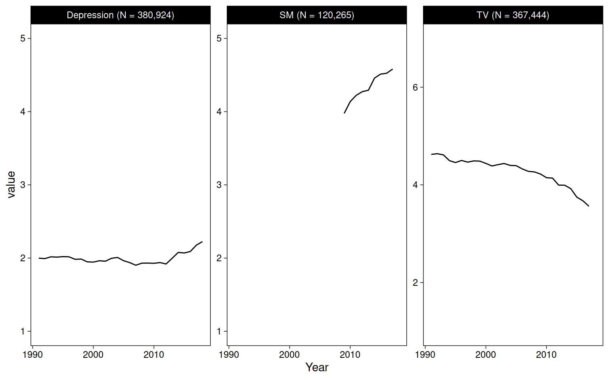

# Data descriptives


## Data


```r
mtf <- read_rds("data/mtf.rds")
us <- read_rds("data/us.rds")
yrbs <- read_rds("data/yrbs.rds")
```

### Sample sizes and years

Sample sizes per dataset are the number of rows that include the outcome variable (there are two for US). The total sample size *in the entire manuscript* is the sum without US-emotion (including both US outcomes would duplicate its N).


```r
tibble(
  mtf = drop_na(mtf, Depression) %>% nrow,
  us_conduct = drop_na(us, Conduct) %>% nrow,
  us_emotion = drop_na(us, Emotion) %>% nrow,
  yrbs = drop_na(yrbs, Suicide) %>% nrow
) %>% 
  mutate(total = mtf + us_conduct + yrbs) %>% 
  mutate(across(.fns = ~comma(.))) %>% 
  kable()
```


|mtf     |us_conduct |us_emotion |yrbs   |total   |
|:-------|:----------|:----------|:------|:-------|
|380,924 |19,190     |19,184     |30,447 |430,561 |

Actual sample sizes used in analyses are the intersections of non-missing values for the two variables (outcome, technology) used in each model.


```r
doit <- function(data, name, x, y) {
  data <- data %>% 
    drop_na(all_of(x), all_of(y))
  data %>% 
    count(Sex) %>% 
    pivot_wider(names_from = Sex, values_from = n) %>% 
    mutate(Total = Female + Male) %>%
    mutate(
      across(
        c(Female, Male), 
        ~str_glue("{comma(.)} ({percent(./Total)})")
      )
    ) %>% 
    mutate(across(where(is.numeric), ~comma(.))) %>% 
    mutate(Years = paste(range(data$Year), collapse = " - ")) %>% 
    mutate(Dataset = name, Technology = x, Outcome = y) %>% 
    select(Dataset, Technology, Outcome, Years, Total, Female, Male)
}
bind_rows(
  doit(mtf, "MTF", "TV", "Depression"),
  doit(mtf, "MTF", "SM", "Depression"),
  doit(us, "US", "TV", "Emotion"),
  doit(us, "US", "SM", "Emotion"),
  doit(us, "US", "TV", "Conduct"),
  doit(us, "US", "SM", "Conduct"),
  doit(yrbs, "YRBS", "TV", "Suicide"),
  doit(yrbs, "YRBS", "DV", "Suicide")
) %>% 
  arrange(Dataset, Technology, Outcome) %>% 
  kable()
```


|Dataset |Technology |Outcome    |Years       |Total   |Female        |Male          |
|:-------|:----------|:----------|:-----------|:-------|:-------------|:-------------|
|MTF     |SM         |Depression |2012 - 2017 |78,357  |40,172 (51%)  |38,185 (49%)  |
|MTF     |TV         |Depression |1991 - 2017 |367,444 |191,859 (52%) |175,585 (48%) |
|US      |SM         |Conduct    |2009 - 2017 |18,815  |9,434 (50%)   |9,381 (50%)   |
|US      |SM         |Emotion    |2009 - 2017 |18,811  |9,432 (50%)   |9,379 (50%)   |
|US      |TV         |Conduct    |2009 - 2017 |19,079  |9,554 (50%)   |9,525 (50%)   |
|US      |TV         |Emotion    |2009 - 2017 |19,074  |9,552 (50%)   |9,522 (50%)   |
|YRBS    |DV         |Suicide    |2007 - 2017 |29,450  |15,424 (52%)  |14,026 (48%)  |
|YRBS    |TV         |Suicide    |2007 - 2017 |29,433  |15,422 (52%)  |14,011 (48%)  |

### Outcomes


```r
mtf %>% 
  select(starts_with("D_B_")) %>% 
  psych::alpha() %>% 
  summary
```

```
## 
## Reliability analysis   
##  raw_alpha std.alpha G6(smc) average_r S/N     ase mean   sd median_r
##       0.85      0.85    0.84      0.48 5.5 0.00039    2 0.95     0.44
```

```r
cor(
  select(mtf, starts_with("D_B_")), 
  use = "pairwise.complete.obs"
) %>% 
  round(2)
```

```
##       D_B_1 D_B_2 D_B_3 D_B_4 D_B_5 D_B_6
## D_B_1  1.00  0.60  0.48  0.34  0.56  0.34
## D_B_2  0.60  1.00  0.57  0.43  0.63  0.45
## D_B_3  0.48  0.57  1.00  0.39  0.59  0.39
## D_B_4  0.34  0.43  0.39  1.00  0.38  0.64
## D_B_5  0.56  0.63  0.59  0.38  1.00  0.40
## D_B_6  0.34  0.45  0.39  0.64  0.40  1.00
```


```r
sdq_con <- c("sdqe", "sdqg", "sdql", "sdqr", "sdqv")
sdq_emo <- c("sdqc", "sdqh", "sdqm", "sdqp", "sdqx")
us %>% 
  select(all_of(sdq_con)) %>% 
  psych::alpha() %>% 
  summary
```

```
## 
## Reliability analysis   
##  raw_alpha std.alpha G6(smc) average_r S/N    ase mean   sd median_r
##       0.62      0.62    0.58      0.25 1.6 0.0041  1.4 0.36     0.24
```

```r
us %>% 
  select(all_of(sdq_emo)) %>% 
  psych::alpha() %>% 
  summary
```

```
## 
## Reliability analysis   
##  raw_alpha std.alpha G6(smc) average_r S/N    ase mean   sd median_r
##       0.69      0.69    0.65      0.31 2.2 0.0035  1.6 0.45     0.29
```

```r
cor(
  select(us, all_of(sdq_con)), 
  use = "pairwise.complete.obs"
) %>% 
  round(2)
```

```
##      sdqe sdqg sdql sdqr sdqv
## sdqe 1.00 0.30 0.34 0.34 0.16
## sdqg 0.30 1.00 0.23 0.24 0.15
## sdql 0.34 0.23 1.00 0.28 0.21
## sdqr 0.34 0.24 0.28 1.00 0.23
## sdqv 0.16 0.15 0.21 0.23 1.00
```

```r
cor(
  select(us, all_of(sdq_emo)), 
  use = "pairwise.complete.obs"
) %>% 
  round(2)
```

```
##      sdqc sdqh sdqm sdqp sdqx
## sdqc 1.00 0.26 0.28 0.19 0.21
## sdqh 0.26 1.00 0.42 0.39 0.39
## sdqm 0.28 0.42 1.00 0.29 0.30
## sdqp 0.19 0.39 0.29 1.00 0.37
## sdqx 0.21 0.39 0.30 0.37 1.00
```

## Figures


```r
mtf %>% 
  pivot_longer(c(TV, SM, Depression)) %>% 
  drop_na(value) %>% 
  add_count(name) %>% 
  mutate(name = str_glue("{name} (N = {comma(n)})")) %>% 
  ggplot(aes(Year, value)) +
  geom_blank() +
  stat_summary(fun=mean, geom="line") +
  facet_wrap("name", scales = "free_y")
```




```r
us %>% 
  pivot_longer(c(SM, TV, Emotion, Conduct)) %>% 
  drop_na(value) %>% 
  add_count(name) %>% 
  mutate(name = str_glue("{name} (N = {comma(n, accuracy = 1)})")) %>%
  ggplot(aes(Year, value)) +
  geom_blank() +
  stat_summary(fun=mean, geom="line") +
  facet_wrap("name", scales = "free_y")
```


```r
yrbs %>% 
  pivot_longer(c(TV, DV, sad_lonely:suicide_3)) %>% 
  drop_na(value) %>% 
  add_count(name) %>% 
  mutate(name = str_glue("{name} (N = {comma(n)})")) %>%
  ggplot(aes(Year, value)) +
  geom_blank() +
  stat_summary(fun=mean, geom="line") +
  facet_wrap("name", scales = "free_y")
```


