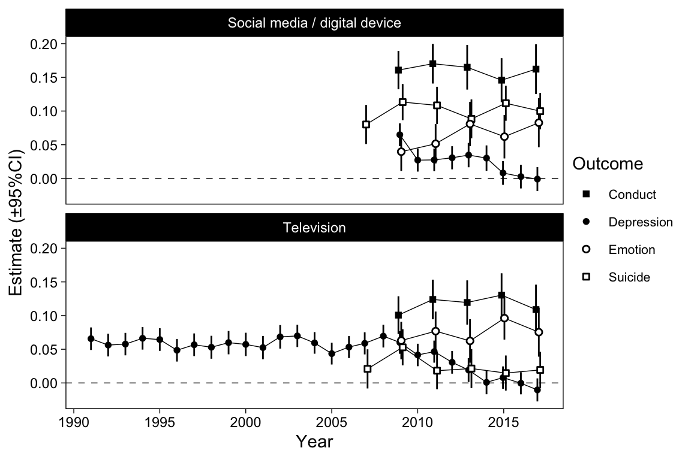

# Generalized Linear Model

This is a first pass. We model the means of the items of each dataset with OLS regression.


## Data 


```r
mtf <- read_rds("data/mtf.rds")
us <- read_rds("data/us.rds")
yrbs <- read_rds("data/yrbs.rds")
```

For US, we also isolate between- and within-person variables.


```r
us <- bmlm::isolate(us, "pidp", "TV", which = "both", z = TRUE)
us <- bmlm::isolate(us, "pidp", "SM", which = "both", z = TRUE)
us <- us %>% select(-TV, -SM)
# We focus on between-person relations so rename those back
us <- us %>% rename(TV = TV_cb, SM = SM_cb)
```

## Yearly correlations figure


```r
fit_year <- function(data, x, y, name) {
  data <- data[,c("Year", x, y, "Sex")]
  names(data) <- c("Year", "x", "y", "Sex")
  data %>% 
    drop_na(x, y) %>% 
    group_by(Year) %>% 
    mutate(
      x = as.numeric(scale(x)), 
      y = as.numeric(scale(y))
    ) %>% 
    group_modify(~broom::tidy(lm(y ~ x*Sex, data = .), conf.int = TRUE)) %>% 
    filter(term=="x") %>% 
    mutate(Technology = x, Outcome = y, data = name)
}
x1 <- fit_year(mtf, "TV", "Depression", "MTF")
x2 <- fit_year(mtf, "SM", "Depression", "MTF")
x3 <- fit_year(yrbs, "TV", "Suicide", "YRBS")
x4 <- fit_year(yrbs, "DV", "Suicide", "YRBS")
x5 <- fit_year(us, "TV", "Emotion", "US")
x6 <- fit_year(us, "TV", "Conduct", "US")
x7 <- fit_year(us, "SM", "Emotion", "US")
x8 <- fit_year(us, "SM", "Conduct", "US")
fits_year <- bind_rows(x1,x2,x3,x4,x5,x6,x7,x8)
# Rename device and social media to a similar construct
fits_year <- fits_year %>% 
  mutate(
    Technology = ifelse(
      Technology %in% c("SM", "DV"), 
      "Social media / digital device", 
      "Television"
    )
  )
fits_year %>%   
  ggplot(
    aes(Year, estimate, shape = Outcome)
  ) +
  geom_hline(yintercept = 0, lty = 2, size = .25) +
  scale_shape_manual(values = c(15, 16, 21, 22)) +
  scale_x_continuous(
    "Year",
    breaks = scales::pretty_breaks()
  ) +
  scale_y_continuous(
    "Estimate (±95%CI)",
    breaks = scales::pretty_breaks()
  ) +
  geom_line(
    position = position_dodge(.33),
    size = .25, 
  ) +
  geom_linerange(
    position = position_dodge(.33),
    show.legend = FALSE,
    aes(ymin = conf.high, ymax = conf.low)
  ) +
  geom_point(
    position = position_dodge(.33),
    fill = "white", stroke = 0.75
  ) +
  facet_wrap("Technology", scales = "fixed", ncol = 1) +
  theme(
    legend.position = "right", 
    legend.background = element_rect(fill = NA), 
    legend.key = element_rect(fill = NA),
    legend.text = element_text(size = 8), 
    legend.box.spacing = unit(0, "cm")
  )
```



```r
ggsave("Figure1.png", width = 6, height = 4)
```


## Models


```r
fit <- function(data, name, x, y) {
  data <- drop_na(data, all_of(x), all_of(y))
  # Standardize X and Y
  data <- mutate(data, across(c(all_of(x), all_of(y)), ~as.numeric(scale(.))))
  data <- mutate(data, Year = Year - 2017)
  ml1 <- lm(
    str_glue("{y} ~ Sex * Year * {x}"),
    data = data
  )
  tibble(
    data = name,
    Technology = x,
    Outcome = y,
    ml1 = list(ml1)
  )
}
x1 <- fit(yrbs, "YRBS", "TV", "Suicide")
x2 <- fit(yrbs, "YRBS", "DV", "Suicide")
x3 <- fit(mtf, "MTF", "TV", "Depression")
x4 <- fit(mtf, "MTF", "SM", "Depression")
x5 <- fit(us, "US", "SM", "Emotion")
x6 <- fit(us, "US", "SM", "Conduct")
x7 <- fit(us, "US", "TV", "Emotion")
x8 <- fit(us, "US", "TV", "Conduct")
```


```r
fits <- bind_rows(x1,x2,x3,x4,x5,x6,x7,x8)
# Labels for plots
fits <- fits %>% 
  mutate(
    Technology = ifelse(
      Technology %in% c("SM", "DV"), 
      "Social media / device", 
      "Television"
    )
  )
```

## Results


```r
fits %>%
  mutate(Outcome = fct_rev(Outcome)) %>% 
  mutate(linear = map(ml1, ~tidy(., conf.int=TRUE))) %>% 
  unnest(linear) %>% 
  mutate(Parameter = case_when(
    term == "Year" ~ "Year",
    term %in% c("TV", "SM", "DV") ~ "Technology",
    term %in% c("Year:TV", "Year:SM", "Year:DV") ~ "Year x Technology"
  )) %>% 
  drop_na(Parameter) %>% 
  mutate(
    Parameter = factor(Parameter, levels = c("Year", "Technology", "Year x Technology"))
  ) %>% 
  ggplot(aes(estimate, Outcome, shape = Technology, fill = p.value < .05)) +
  scale_shape_manual(values = c(21, 22)) +
  scale_fill_manual(values = c("white", "black"), guide = FALSE) +
  scale_x_continuous(
    "Parameter estimate",
    breaks = scales::pretty_breaks(), 
    expand = expansion(.1)
  ) +
  geom_vline(xintercept = 0, lty = 2, size = .25) +
  geom_linerangeh(
    position = position_dodge2v(.4),
    aes(xmin = conf.low, xmax = conf.high)
  ) +
  geom_point(
    size = 2, position = position_dodge2v(.4),
  ) +
  facet_wrap("Parameter", scales = "free_x") +
  theme(
    legend.position = "bottom",
    axis.title.y = element_blank(), 
    panel.spacing.x = unit(12, "pt")
  )
```


YRBS with separate logistic regressions for each outcome


```r
tmp <- yrbs %>% pivot_longer(sad_lonely:suicide_3)
tmp_tv <- tmp %>% 
  group_by(name) %>% 
  mutate(TV = as.numeric(scale(TV)), Year = Year-2017) %>% 
  group_modify(~tidy(glm(value ~ Year*TV, family = binomial, data = .), conf.int = TRUE)) %>% 
  filter(term != "(Intercept)")
tmp_dv <- tmp %>% 
  group_by(name) %>% 
  mutate(DV = as.numeric(scale(DV)), Year = Year-2017) %>% 
  group_modify(~tidy(glm(value ~ Year*DV, family = binomial, data = .), conf.int = TRUE)) %>% 
  filter(term != "(Intercept)")
bind_rows(tmp_dv, tmp_tv, .id = "Technology") %>% 
  mutate(Technology = factor(Technology, labels = c("DV", "TV"))) %>% 
  mutate(Parameter = case_when(
    term == "Year" ~ "Year",
    term %in% c("TV", "DV") ~ "Technology",
    term %in% c("Year:TV", "Year:DV") ~ "Year x Technology"
  )) %>%
  drop_na(Parameter) %>%
  mutate(
    Parameter = factor(Parameter, levels = c("Year", "Technology", "Year x Technology"))
  ) %>% 
  ggplot(aes(estimate, name, fill = p.value < .05, shape = Technology)) +
  scale_fill_manual(values = c("white", "black"), guide = FALSE) +
  scale_shape_manual(values = c(21, 22)) +
  scale_x_continuous(
    "Parameter estimate",
    breaks = scales::pretty_breaks(), 
    expand = expansion(.1)
  ) +
  geom_vline(xintercept = 0, lty = 2, size = .25) +
  geom_linerangeh(
    position = position_dodge2v(.4),
    aes(xmin = conf.low, xmax = conf.high)
  ) +
  geom_point(
    size = 2, position = position_dodge2v(.4),
  ) +
  facet_wrap("Parameter", scales = "free_x") +
  theme(
    legend.position = "bottom",
    axis.title.y = element_blank(), 
    panel.spacing.x = unit(12, "pt")
  )
```


```r
library(sessioninfo)
session_info()
```

```
## ─ Session info ───────────────────────────────────────────────────────────────
##  setting  value                       
##  version  R version 4.0.2 (2020-06-22)
##  os       macOS Catalina 10.15.7      
##  system   x86_64, darwin17.0          
##  ui       X11                         
##  language (EN)                        
##  collate  en_GB.UTF-8                 
##  ctype    en_GB.UTF-8                 
##  tz       Europe/London               
##  date     2020-10-02                  
## 
## ─ Packages ───────────────────────────────────────────────────────────────────
##  package      * version    date       lib source                              
##  assertthat     0.2.1      2019-03-21 [1] CRAN (R 4.0.0)                      
##  backports      1.1.10     2020-09-15 [1] CRAN (R 4.0.2)                      
##  blob           1.2.1      2020-01-20 [1] CRAN (R 4.0.0)                      
##  bmlm           1.3.11     2019-02-21 [1] CRAN (R 4.0.0)                      
##  bookdown       0.20       2020-06-23 [1] CRAN (R 4.0.2)                      
##  broom        * 0.7.0.9001 2020-07-23 [1] Github (tidymodels/broom@7db1139)   
##  callr          3.4.4      2020-09-07 [1] CRAN (R 4.0.2)                      
##  cellranger     1.1.0      2016-07-27 [1] CRAN (R 4.0.0)                      
##  cli            2.0.2      2020-02-28 [1] CRAN (R 4.0.0)                      
##  coda           0.19-3     2019-07-05 [1] CRAN (R 4.0.0)                      
##  codetools      0.2-16     2018-12-24 [1] CRAN (R 4.0.2)                      
##  colorspace     1.4-1      2019-03-18 [1] CRAN (R 4.0.0)                      
##  crayon         1.3.4      2017-09-16 [1] CRAN (R 4.0.0)                      
##  curl           4.3        2019-12-02 [1] CRAN (R 4.0.0)                      
##  DBI            1.1.0      2019-12-15 [1] CRAN (R 4.0.0)                      
##  dbplyr         1.4.4      2020-05-27 [1] CRAN (R 4.0.0)                      
##  digest         0.6.25     2020-02-23 [1] CRAN (R 4.0.0)                      
##  dplyr        * 1.0.2      2020-08-18 [1] CRAN (R 4.0.2)                      
##  ellipsis       0.3.1      2020-05-15 [1] CRAN (R 4.0.0)                      
##  emmeans      * 1.5.1      2020-09-18 [1] CRAN (R 4.0.2)                      
##  estimability   1.3        2018-02-11 [1] CRAN (R 4.0.0)                      
##  evaluate       0.14       2019-05-28 [1] CRAN (R 4.0.0)                      
##  fansi          0.4.1      2020-01-08 [1] CRAN (R 4.0.0)                      
##  farver         2.0.3      2020-01-16 [1] CRAN (R 4.0.0)                      
##  forcats      * 0.5.0      2020-03-01 [1] CRAN (R 4.0.0)                      
##  fs             1.5.0      2020-07-31 [1] CRAN (R 4.0.2)                      
##  generics       0.0.2      2018-11-29 [1] CRAN (R 4.0.0)                      
##  ggplot2      * 3.3.2      2020-06-19 [1] CRAN (R 4.0.1)                      
##  ggstance     * 0.3.4      2020-04-02 [1] CRAN (R 4.0.0)                      
##  glue           1.4.2      2020-08-27 [1] CRAN (R 4.0.2)                      
##  gridExtra      2.3        2017-09-09 [1] CRAN (R 4.0.0)                      
##  gtable         0.3.0      2019-03-25 [1] CRAN (R 4.0.0)                      
##  haven          2.3.1      2020-06-01 [1] CRAN (R 4.0.0)                      
##  hms            0.5.3      2020-01-08 [1] CRAN (R 4.0.0)                      
##  htmltools      0.5.0      2020-06-16 [1] CRAN (R 4.0.1)                      
##  httr           1.4.2      2020-07-20 [1] CRAN (R 4.0.2)                      
##  inline         0.3.16     2020-09-06 [1] CRAN (R 4.0.2)                      
##  jsonlite       1.7.1      2020-09-07 [1] CRAN (R 4.0.2)                      
##  knitr        * 1.30       2020-09-22 [1] CRAN (R 4.0.2)                      
##  lattice        0.20-41    2020-04-02 [1] CRAN (R 4.0.2)                      
##  lifecycle      0.2.0      2020-03-06 [1] CRAN (R 4.0.0)                      
##  loo            2.3.1      2020-07-14 [1] CRAN (R 4.0.2)                      
##  lubridate      1.7.9      2020-06-08 [1] CRAN (R 4.0.1)                      
##  magrittr       1.5        2014-11-22 [1] CRAN (R 4.0.0)                      
##  MASS         * 7.3-53     2020-09-09 [1] CRAN (R 4.0.2)                      
##  Matrix         1.2-18     2019-11-27 [1] CRAN (R 4.0.2)                      
##  matrixStats    0.57.0     2020-09-25 [1] CRAN (R 4.0.2)                      
##  modelr         0.1.8      2020-05-19 [1] CRAN (R 4.0.0)                      
##  multcomp     * 1.4-13     2020-04-08 [1] CRAN (R 4.0.0)                      
##  munsell        0.5.0      2018-06-12 [1] CRAN (R 4.0.0)                      
##  mvtnorm      * 1.1-1      2020-06-09 [1] CRAN (R 4.0.0)                      
##  pacman         0.5.1      2019-03-11 [1] CRAN (R 4.0.0)                      
##  pillar         1.4.6      2020-07-10 [1] CRAN (R 4.0.2)                      
##  pkgbuild       1.1.0      2020-07-13 [1] CRAN (R 4.0.2)                      
##  pkgconfig      2.0.3      2019-09-22 [1] CRAN (R 4.0.0)                      
##  prettyunits    1.1.1      2020-01-24 [1] CRAN (R 4.0.0)                      
##  processx       3.4.4      2020-09-03 [1] CRAN (R 4.0.2)                      
##  ps             1.3.4      2020-08-11 [1] CRAN (R 4.0.2)                      
##  purrr        * 0.3.4      2020-04-17 [1] CRAN (R 4.0.0)                      
##  R6             2.4.1      2019-11-12 [1] CRAN (R 4.0.0)                      
##  Rcpp           1.0.5      2020-07-06 [1] CRAN (R 4.0.2)                      
##  RcppParallel   5.0.2      2020-06-24 [1] CRAN (R 4.0.0)                      
##  readr        * 1.3.1      2018-12-21 [1] CRAN (R 4.0.0)                      
##  readxl         1.3.1      2019-03-13 [1] CRAN (R 4.0.0)                      
##  reprex         0.3.0      2019-05-16 [1] CRAN (R 4.0.0)                      
##  rlang          0.4.7      2020-07-09 [1] CRAN (R 4.0.2)                      
##  rmarkdown      2.4.0      2020-09-11 [1] Github (cpsievert/rmarkdown@b79fb4d)
##  rstan          2.21.3     2020-09-29 [1] Github (stan-dev/rstan@ae36e6f)     
##  rstudioapi     0.11       2020-02-07 [1] CRAN (R 4.0.0)                      
##  rvest          0.3.6      2020-07-25 [1] CRAN (R 4.0.2)                      
##  sandwich       2.5-1      2019-04-06 [1] CRAN (R 4.0.0)                      
##  scales       * 1.1.1      2020-05-11 [1] CRAN (R 4.0.0)                      
##  sessioninfo  * 1.1.1      2018-11-05 [1] CRAN (R 4.0.0)                      
##  StanHeaders    2.21.0-6   2020-08-16 [1] CRAN (R 4.0.2)                      
##  stringi        1.5.3      2020-09-09 [1] CRAN (R 4.0.2)                      
##  stringr      * 1.4.0      2019-02-10 [1] CRAN (R 4.0.0)                      
##  survival     * 3.2-3      2020-06-13 [1] CRAN (R 4.0.2)                      
##  TH.data      * 1.0-10     2019-01-21 [1] CRAN (R 4.0.0)                      
##  tibble       * 3.0.3      2020-07-10 [1] CRAN (R 4.0.2)                      
##  tidyr        * 1.1.2      2020-08-27 [1] CRAN (R 4.0.2)                      
##  tidyselect     1.1.0      2020-05-11 [1] CRAN (R 4.0.0)                      
##  tidyverse    * 1.3.0      2019-11-21 [1] CRAN (R 4.0.0)                      
##  V8             3.2.0      2020-06-19 [1] CRAN (R 4.0.2)                      
##  vctrs          0.3.4      2020-08-29 [1] CRAN (R 4.0.2)                      
##  withr          2.3.0      2020-09-22 [1] CRAN (R 4.0.2)                      
##  xfun           0.18       2020-09-29 [1] CRAN (R 4.0.2)                      
##  xml2           1.3.2      2020-04-23 [1] CRAN (R 4.0.0)                      
##  xtable         1.8-4      2019-04-21 [1] CRAN (R 4.0.0)                      
##  yaml           2.2.1      2020-02-01 [1] CRAN (R 4.0.0)                      
##  zoo            1.8-8      2020-05-02 [1] CRAN (R 4.0.0)                      
## 
## [1] /Library/Frameworks/R.framework/Versions/4.0/Resources/library
```
