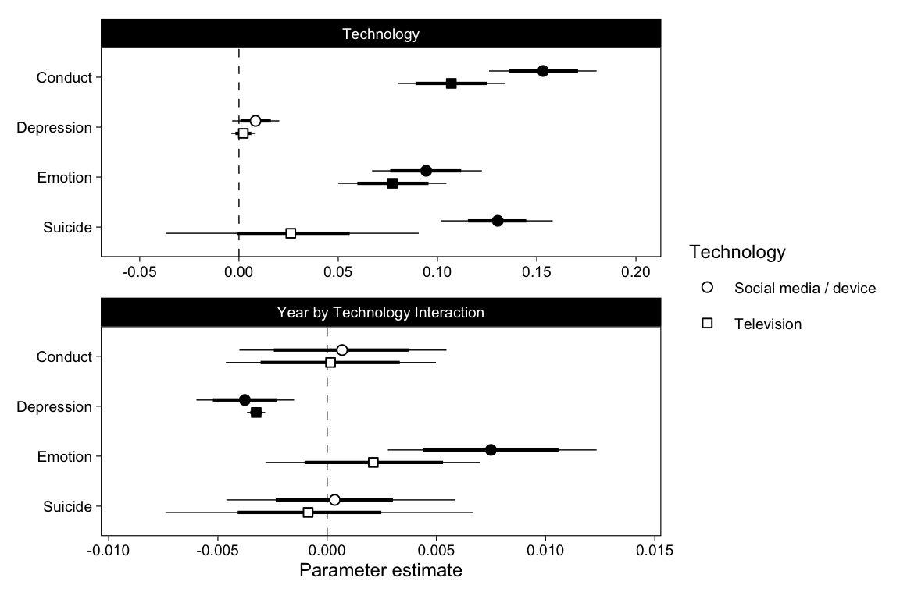

# Bayesian Generalized Linear Mixed Model


For each dataset and outcome, we fit a GLMM using brms, in order to do full bayesian inference. These models take a while to run. 

## Data


```r
mtf <- read_rds("data/mtf.rds")
us <- read_rds("data/us.rds")
yrbs <- read_rds("data/yrbs.rds")
```

For US, we also isolate between- and within-person variables.


```r
# Within-person center variables (Vuorre & Bolger, 2017)
us <- bmlm::isolate(us, "pidp", "TV", which = "both", z = TRUE)
us <- bmlm::isolate(us, "pidp", "SM", which = "both", z = TRUE)
us <- us %>% select(-TV, -SM)
# We focus on between-person relations so rename those back
us <- us %>% rename(TV = TV_cb, SM = SM_cb)
```

YRBS is in long format wrt items


```r
yrbs <- yrbs %>% 
  select(-suicide_4, -Suicide) %>% 
  pivot_longer(
    sad_lonely:suicide_3, 
    names_to = "item", values_to = "Suicide"
  )
```

## Models

### Estimate

MTF: Single level model
US: Random intercepts for participants. 85% of participants have only 1 or 2 observations, so random slopes without strong priors are not a good idea.
YRBS: Full item-specific random effects.


```r
fit <- function(data, name, x, y, iter = 1000, chains = 12, cores = 12) {
  data <- drop_na(data, all_of(x), all_of(y))
  data <- mutate(data, Year = Year - 2017)
  if (name=="YRBS") {
    data <- data %>% 
      mutate(across(all_of(x), ~as.numeric(scale(.))))
    ml1 <- brm(
      str_glue("{y} ~ Sex * Year * {x} + (Sex * Year * {x} | item)"), 
      family = bernoulli("probit_approx"),
      control = list(adapt_delta = .98),
      prior = prior(student_t(9, 0, 1), class = "sd") +
        prior(normal(0, 1), class = "b"),
      inits = "0",
      data = data, chains = chains, iter = iter, cores = cores,
      file = str_glue("models/brm-{name}-{x}-{y}-ml1-probit")
    )
  } else if (name=="MTF") {
    data <- data %>% 
      mutate(across(c(all_of(x), all_of(y)), ~as.numeric(scale(.))))
    ml1 <- brm(
      str_glue("{y} ~ Sex * Year * {x}"), 
      control = list(adapt_delta = .9),
      data = data, chains = chains, iter = iter, cores = cores,
      file = str_glue("models/brm-{name}-{x}-{y}-ml1")
    )
  } else if (name=="US") {
    data <- data %>% 
      mutate(across(c(all_of(x), all_of(y)), ~as.numeric(scale(.))))
    ml1 <- brm(
      str_glue("{y} ~ Sex * Year * {x} + (1 | pidp)"), 
      control = list(adapt_delta = .9),
      data = data, chains = chains, iter = iter, cores = cores,
      file = str_glue("models/brm-{name}-{x}-{y}-ml1")
    )
  }
  tibble(
    data = name,
    Technology = x,
    Outcome = y,
    ml1 = list(ml1)
  )
}
```


```r
x1 <- fit(yrbs, "YRBS", "TV", "Suicide")
x2 <- fit(yrbs, "YRBS", "DV", "Suicide")
x3 <- fit(mtf, "MTF", "TV", "Depression")
x4 <- fit(mtf, "MTF", "SM", "Depression")
x5 <- fit(us, "US", "SM", "Emotion")
x6 <- fit(us, "US", "SM", "Conduct")
x7 <- fit(us, "US", "TV", "Emotion")
x8 <- fit(us, "US", "TV", "Conduct")
```


```r
# Rename variables
fits <- bind_rows(x1,x2,x3,x4,x5,x6,x7,x8)
fits <- fits %>% 
  mutate(
    Technology = ifelse(
      Technology %in% c("SM", "DV"), 
      "Social media / device", 
      "Television"
    )
  )
```

### Results


```r
probs <- c(.025, .1, .9, .975)
pars <- fits %>% 
  mutate(
    p = map(
      ml1, ~posterior_summary(., pars = "^b_", probs = probs) %>%
        as.data.frame() %>% 
        rownames_to_column("Parameter") %>% 
        tibble()
    )
  ) %>%
  unnest(p) %>% 
  select(-ml1)
b_Year <- pars %>% 
  filter(Parameter == "b_Year") %>% 
  mutate(Parameter = "Year")
b_Tech <- pars %>% 
  filter(Parameter %in% c("b_TV", "b_DV", "b_SM")) %>% 
  mutate(Parameter = "Technology")
b_Interaction <- pars %>% 
  filter(Parameter %in% c("b_Year:TV", "b_Year:DV", "b_Year:SM")) %>% 
  mutate(Parameter = "Year by Technology Interaction")
p1 <- bind_rows(b_Year, b_Tech, b_Interaction) %>% 
  mutate(Outcome = fct_rev(Outcome)) %>% 
  # Fill points based on if 95%CI includes zero
  mutate(
    Zero = ifelse(
      sign(Q2.5) == sign(Estimate) & sign(Estimate) == sign(Q97.5), 
      "*", ""
    )
  ) %>% 
  mutate(
    Parameter = factor(Parameter, levels = c("Year", "Technology", "Year by Technology Interaction"))
  ) %>% 
  ggplot(aes(Estimate, Outcome, shape = Technology, fill = Zero)) +
  scale_shape_manual(values = c(21, 22)) +
  scale_fill_manual(values = c("white", "black"), guide = FALSE) +
  scale_x_continuous(
    "Parameter estimate",
    breaks = scales::pretty_breaks(), 
    expand = expansion(.15)
  ) +
  geom_vline(xintercept = 0, lty = 2, size = .25) +
  geom_linerangeh(
    aes(xmin = Q2.5, xmax = Q97.5), size = .25,
    position = position_dodge2v(.5), show.legend = FALSE
  ) +
  geom_linerangeh(
    aes(xmin = Q10, xmax = Q90), size = .75,
    position = position_dodge2v(.5), show.legend = FALSE
  ) +
  geom_point(
    size = 2, position = position_dodge2v(.5),
  ) +
  facet_wrap("Parameter", scales = "free_x", nrow = 1) +
  theme(
    legend.position = "right",
    axis.title.y = element_blank(), 
    panel.spacing.x = unit(12, "pt")
  )

((p1 %+% 
    filter(p1$data, Parameter %in% c("Technology")) +
    theme(axis.title.x = element_blank())) /
  p1 %+% filter(p1$data, Parameter == "Year by Technology Interaction")) +
  plot_layout(guides = "collect") &
  theme(legend.position = "right")
```



```r
ggsave("Figure2.png", width = 6, height = 4)
```


```r
# Get YRBS item-specific effects
tmp1 <- slice(fits, 1:2) %>% 
  mutate(
    o = map(ml1, ~rownames_to_column(as.data.frame(coef(.)$item[,,7])))
  ) %>% 
  unnest(o)

tmp <- fits %>% 
  mutate(
    p = map(
      ml1, ~posterior_summary(., pars = "b_Year:[TV|SM|DV]") %>%
        as.data.frame() %>% 
        rownames_to_column() %>% 
        tibble()
    )
  ) %>%
  unnest(p)
tmp %>%   
  ggplot(aes(Estimate, Outcome, col = Outcome)) +
  scale_color_brewer(palette = "Set1") +
  scale_x_continuous(
    "Linear interaction estimate (±95%CI)",
    breaks = scales::pretty_breaks(), 
    expand = expansion(.2)
  ) +
  geom_vline(xintercept = 0, size = .25, lty = 2) +
  ggstance::geom_pointrangeh(
    shape = 21, fill = "white", fatten = 3,
    aes(xmin=Q2.5, xmax=Q97.5)
  ) +
  # ggstance::geom_pointrangeh(
  #   data = tmp1, aes(xmin = Q2.5, xmax = Q97.5),
  #   size = .25, fatten = 1,
  #   position = ggstance::position_dodge2v(.25)
  # ) +
  facet_wrap("Technology") +
  theme(
    axis.title.y = element_blank(),
    legend.position = "none",
    legend.text = element_text(size = 8)
  )
```


```r
# Sex
pars %>% 
  filter(str_detect(Parameter, "Sex1:Year:")) %>% 
  mutate(Parameter = "Sex x Year x Tech") %>% 
  ggplot(aes(Estimate, Outcome, shape = Technology)) +
  scale_color_brewer(palette = "Set1") +
  scale_x_continuous(
    "Estimated parameter",
    breaks = scales::pretty_breaks(), 
    expand = expansion(.25)
  ) +
  geom_vline(xintercept = 0, lty = 2, size = .25) +
  geom_linerangeh(
    aes(xmin = Q2.5, xmax = Q97.5), size = .25,
    position = position_dodge2v(.4), show.legend = FALSE
  ) +
  geom_linerangeh(
    aes(xmin = Q10, xmax = Q90), size = .75,
    position = position_dodge2v(.4), show.legend = FALSE
  ) +
  geom_point(
    size = 2, position = position_dodge2v(.4)
  ) +
  facet_wrap("Parameter", scales = "free_x", nrow = 1) +
  theme(
    legend.position = "bottom",
    axis.title.y = element_blank(), 
    panel.spacing.x = unit(12, "pt")
  )
```


```r
library(sessioninfo)
session_info()
```

```
## ─ Session info ───────────────────────────────────────────────────────────────
##  setting  value                       
##  version  R version 4.0.2 (2020-06-22)
##  os       macOS Catalina 10.15.7      
##  system   x86_64, darwin17.0          
##  ui       X11                         
##  language (EN)                        
##  collate  en_GB.UTF-8                 
##  ctype    en_GB.UTF-8                 
##  tz       Europe/London               
##  date     2020-10-02                  
## 
## ─ Packages ───────────────────────────────────────────────────────────────────
##  package        * version    date       lib
##  abind            1.4-5      2016-07-21 [1]
##  assertthat       0.2.1      2019-03-21 [1]
##  backports        1.1.10     2020-09-15 [1]
##  base64enc        0.1-3      2015-07-28 [1]
##  bayesplot        1.7.2      2020-05-28 [1]
##  blob             1.2.1      2020-01-20 [1]
##  bmlm             1.3.11     2019-02-21 [1]
##  bookdown         0.20       2020-06-23 [1]
##  bridgesampling   1.0-0      2020-02-26 [1]
##  brms           * 2.13.10    2020-09-29 [1]
##  Brobdingnag      1.2-6      2018-08-13 [1]
##  broom            0.7.0.9001 2020-07-23 [1]
##  callr            3.4.4      2020-09-07 [1]
##  cellranger       1.1.0      2016-07-27 [1]
##  cli              2.0.2      2020-02-28 [1]
##  coda             0.19-3     2019-07-05 [1]
##  codetools        0.2-16     2018-12-24 [1]
##  colorspace       1.4-1      2019-03-18 [1]
##  colourpicker     1.1.0      2020-09-14 [1]
##  crayon           1.3.4      2017-09-16 [1]
##  crosstalk        1.1.0.1    2020-03-13 [1]
##  curl             4.3        2019-12-02 [1]
##  DBI              1.1.0      2019-12-15 [1]
##  dbplyr           1.4.4      2020-05-27 [1]
##  digest           0.6.25     2020-02-23 [1]
##  dplyr          * 1.0.2      2020-08-18 [1]
##  DT               0.15       2020-08-05 [1]
##  dygraphs         1.1.1.6    2018-07-11 [1]
##  ellipsis         0.3.1      2020-05-15 [1]
##  emmeans          1.5.1      2020-09-18 [1]
##  estimability     1.3        2018-02-11 [1]
##  evaluate         0.14       2019-05-28 [1]
##  fansi            0.4.1      2020-01-08 [1]
##  farver           2.0.3      2020-01-16 [1]
##  fastmap          1.0.1      2019-10-08 [1]
##  forcats        * 0.5.0      2020-03-01 [1]
##  fs               1.5.0      2020-07-31 [1]
##  future         * 1.19.1     2020-09-22 [1]
##  generics         0.0.2      2018-11-29 [1]
##  ggplot2        * 3.3.2      2020-06-19 [1]
##  ggridges         0.5.2      2020-01-12 [1]
##  ggstance       * 0.3.4      2020-04-02 [1]
##  globals          0.13.0     2020-09-17 [1]
##  glue             1.4.2      2020-08-27 [1]
##  gridExtra        2.3        2017-09-09 [1]
##  gtable           0.3.0      2019-03-25 [1]
##  gtools           3.8.2      2020-03-31 [1]
##  haven            2.3.1      2020-06-01 [1]
##  hms              0.5.3      2020-01-08 [1]
##  htmltools        0.5.0      2020-06-16 [1]
##  htmlwidgets      1.5.1      2019-10-08 [1]
##  httpuv           1.5.4      2020-06-06 [1]
##  httr             1.4.2      2020-07-20 [1]
##  igraph           1.2.5      2020-03-19 [1]
##  inline           0.3.16     2020-09-06 [1]
##  jsonlite         1.7.1      2020-09-07 [1]
##  knitr          * 1.30       2020-09-22 [1]
##  later            1.1.0.1    2020-06-05 [1]
##  lattice          0.20-41    2020-04-02 [1]
##  lifecycle        0.2.0      2020-03-06 [1]
##  listenv          0.8.0      2019-12-05 [1]
##  loo              2.3.1      2020-07-14 [1]
##  lubridate        1.7.9      2020-06-08 [1]
##  magrittr         1.5        2014-11-22 [1]
##  markdown         1.1        2019-08-07 [1]
##  MASS             7.3-53     2020-09-09 [1]
##  Matrix           1.2-18     2019-11-27 [1]
##  matrixStats      0.57.0     2020-09-25 [1]
##  mime             0.9        2020-02-04 [1]
##  miniUI           0.1.1.1    2018-05-18 [1]
##  modelr           0.1.8      2020-05-19 [1]
##  multcomp         1.4-13     2020-04-08 [1]
##  munsell          0.5.0      2018-06-12 [1]
##  mvtnorm          1.1-1      2020-06-09 [1]
##  nlme             3.1-149    2020-08-23 [1]
##  pacman           0.5.1      2019-03-11 [1]
##  patchwork      * 1.0.1      2020-06-22 [1]
##  pillar           1.4.6      2020-07-10 [1]
##  pkgbuild         1.1.0      2020-07-13 [1]
##  pkgconfig        2.0.3      2019-09-22 [1]
##  plyr             1.8.6      2020-03-03 [1]
##  prettyunits      1.1.1      2020-01-24 [1]
##  processx         3.4.4      2020-09-03 [1]
##  promises         1.1.1      2020-06-09 [1]
##  ps               1.3.4      2020-08-11 [1]
##  purrr          * 0.3.4      2020-04-17 [1]
##  R6               2.4.1      2019-11-12 [1]
##  Rcpp           * 1.0.5      2020-07-06 [1]
##  RcppParallel     5.0.2      2020-06-24 [1]
##  readr          * 1.3.1      2018-12-21 [1]
##  readxl           1.3.1      2019-03-13 [1]
##  reprex           0.3.0      2019-05-16 [1]
##  reshape2         1.4.4      2020-04-09 [1]
##  rlang            0.4.7      2020-07-09 [1]
##  rmarkdown        2.4.0      2020-09-11 [1]
##  rsconnect        0.8.16     2019-12-13 [1]
##  rstan            2.21.3     2020-09-29 [1]
##  rstantools       2.1.1      2020-07-06 [1]
##  rstudioapi       0.11       2020-02-07 [1]
##  rvest            0.3.6      2020-07-25 [1]
##  sandwich         2.5-1      2019-04-06 [1]
##  scales           1.1.1      2020-05-11 [1]
##  sessioninfo    * 1.1.1      2018-11-05 [1]
##  shiny            1.5.0      2020-06-23 [1]
##  shinyjs          2.0.0      2020-09-09 [1]
##  shinystan        2.5.0      2018-05-01 [1]
##  shinythemes      1.1.2      2018-11-06 [1]
##  StanHeaders      2.21.0-6   2020-08-16 [1]
##  stringi          1.5.3      2020-09-09 [1]
##  stringr        * 1.4.0      2019-02-10 [1]
##  survival         3.2-3      2020-06-13 [1]
##  TH.data          1.0-10     2019-01-21 [1]
##  threejs          0.3.3      2020-01-21 [1]
##  tibble         * 3.0.3      2020-07-10 [1]
##  tidyr          * 1.1.2      2020-08-27 [1]
##  tidyselect       1.1.0      2020-05-11 [1]
##  tidyverse      * 1.3.0      2019-11-21 [1]
##  V8               3.2.0      2020-06-19 [1]
##  vctrs            0.3.4      2020-08-29 [1]
##  withr            2.3.0      2020-09-22 [1]
##  xfun             0.18       2020-09-29 [1]
##  xml2             1.3.2      2020-04-23 [1]
##  xtable           1.8-4      2019-04-21 [1]
##  xts              0.12.1     2020-09-09 [1]
##  yaml             2.2.1      2020-02-01 [1]
##  zoo              1.8-8      2020-05-02 [1]
##  source                              
##  CRAN (R 4.0.0)                      
##  CRAN (R 4.0.0)                      
##  CRAN (R 4.0.2)                      
##  CRAN (R 4.0.0)                      
##  CRAN (R 4.0.0)                      
##  CRAN (R 4.0.0)                      
##  CRAN (R 4.0.0)                      
##  CRAN (R 4.0.2)                      
##  CRAN (R 4.0.0)                      
##  Github (paul-buerkner/brms@9f75e2d) 
##  CRAN (R 4.0.0)                      
##  Github (tidymodels/broom@7db1139)   
##  CRAN (R 4.0.2)                      
##  CRAN (R 4.0.0)                      
##  CRAN (R 4.0.0)                      
##  CRAN (R 4.0.0)                      
##  CRAN (R 4.0.2)                      
##  CRAN (R 4.0.0)                      
##  CRAN (R 4.0.2)                      
##  CRAN (R 4.0.0)                      
##  CRAN (R 4.0.0)                      
##  CRAN (R 4.0.0)                      
##  CRAN (R 4.0.0)                      
##  CRAN (R 4.0.0)                      
##  CRAN (R 4.0.0)                      
##  CRAN (R 4.0.2)                      
##  CRAN (R 4.0.2)                      
##  CRAN (R 4.0.0)                      
##  CRAN (R 4.0.0)                      
##  CRAN (R 4.0.2)                      
##  CRAN (R 4.0.0)                      
##  CRAN (R 4.0.0)                      
##  CRAN (R 4.0.0)                      
##  CRAN (R 4.0.0)                      
##  CRAN (R 4.0.0)                      
##  CRAN (R 4.0.0)                      
##  CRAN (R 4.0.2)                      
##  CRAN (R 4.0.2)                      
##  CRAN (R 4.0.0)                      
##  CRAN (R 4.0.1)                      
##  CRAN (R 4.0.0)                      
##  CRAN (R 4.0.0)                      
##  CRAN (R 4.0.2)                      
##  CRAN (R 4.0.2)                      
##  CRAN (R 4.0.0)                      
##  CRAN (R 4.0.0)                      
##  CRAN (R 4.0.0)                      
##  CRAN (R 4.0.0)                      
##  CRAN (R 4.0.0)                      
##  CRAN (R 4.0.1)                      
##  CRAN (R 4.0.0)                      
##  CRAN (R 4.0.0)                      
##  CRAN (R 4.0.2)                      
##  CRAN (R 4.0.0)                      
##  CRAN (R 4.0.2)                      
##  CRAN (R 4.0.2)                      
##  CRAN (R 4.0.2)                      
##  CRAN (R 4.0.0)                      
##  CRAN (R 4.0.2)                      
##  CRAN (R 4.0.0)                      
##  CRAN (R 4.0.0)                      
##  CRAN (R 4.0.2)                      
##  CRAN (R 4.0.1)                      
##  CRAN (R 4.0.0)                      
##  CRAN (R 4.0.0)                      
##  CRAN (R 4.0.2)                      
##  CRAN (R 4.0.2)                      
##  CRAN (R 4.0.2)                      
##  CRAN (R 4.0.0)                      
##  CRAN (R 4.0.0)                      
##  CRAN (R 4.0.0)                      
##  CRAN (R 4.0.0)                      
##  CRAN (R 4.0.0)                      
##  CRAN (R 4.0.0)                      
##  CRAN (R 4.0.2)                      
##  CRAN (R 4.0.0)                      
##  CRAN (R 4.0.2)                      
##  CRAN (R 4.0.2)                      
##  CRAN (R 4.0.2)                      
##  CRAN (R 4.0.0)                      
##  CRAN (R 4.0.0)                      
##  CRAN (R 4.0.0)                      
##  CRAN (R 4.0.2)                      
##  CRAN (R 4.0.1)                      
##  CRAN (R 4.0.2)                      
##  CRAN (R 4.0.0)                      
##  CRAN (R 4.0.0)                      
##  CRAN (R 4.0.2)                      
##  CRAN (R 4.0.0)                      
##  CRAN (R 4.0.0)                      
##  CRAN (R 4.0.0)                      
##  CRAN (R 4.0.0)                      
##  CRAN (R 4.0.0)                      
##  CRAN (R 4.0.2)                      
##  Github (cpsievert/rmarkdown@b79fb4d)
##  CRAN (R 4.0.0)                      
##  Github (stan-dev/rstan@ae36e6f)     
##  CRAN (R 4.0.2)                      
##  CRAN (R 4.0.0)                      
##  CRAN (R 4.0.2)                      
##  CRAN (R 4.0.0)                      
##  CRAN (R 4.0.0)                      
##  CRAN (R 4.0.0)                      
##  CRAN (R 4.0.0)                      
##  CRAN (R 4.0.2)                      
##  CRAN (R 4.0.0)                      
##  CRAN (R 4.0.0)                      
##  CRAN (R 4.0.2)                      
##  CRAN (R 4.0.2)                      
##  CRAN (R 4.0.0)                      
##  CRAN (R 4.0.2)                      
##  CRAN (R 4.0.0)                      
##  CRAN (R 4.0.0)                      
##  CRAN (R 4.0.2)                      
##  CRAN (R 4.0.2)                      
##  CRAN (R 4.0.0)                      
##  CRAN (R 4.0.0)                      
##  CRAN (R 4.0.2)                      
##  CRAN (R 4.0.2)                      
##  CRAN (R 4.0.2)                      
##  CRAN (R 4.0.2)                      
##  CRAN (R 4.0.0)                      
##  CRAN (R 4.0.0)                      
##  CRAN (R 4.0.2)                      
##  CRAN (R 4.0.0)                      
##  CRAN (R 4.0.0)                      
## 
## [1] /Library/Frameworks/R.framework/Versions/4.0/Resources/library
```
