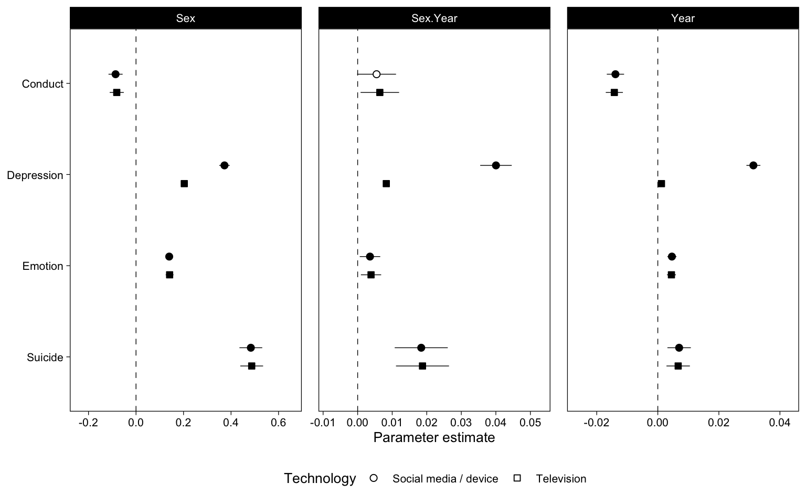

# Latent Variable Models


```r
# Parallel processing settings
plan(multisession(workers = parallel::detectCores(logical = FALSE)))
```

## Data


```r
mtf <- read_rds("data/mtf.rds")
us <- read_rds("data/us.rds")
yrbs <- read_rds("data/yrbs.rds")
```

## Models


```r
fit <- function(data, items, x, y, name, missing = "ml") {
  # Center year
  data <- mutate(data, Year = Year - 2017)
  
  # Contrast code sex
  data <- mutate(data, Sex = ifelse(Sex=="Male", -0.5, 0.5))
  
  # Drop rows with missing predictor
  data <- drop_na(data, all_of(x))
  
  # Drop rows where all outcome items are missing
  data <- drop_na(data, all_of(y))
  
  # Mean-center predictors
  data <- data %>% 
    mutate(
      across(
        all_of(x), 
        ~as.numeric(scale(., center = TRUE, scale = FALSE))
      )
    )
  
  # Ordered?
  if (name=="YRBS") {
    data <- mutate(data, across(sad_lonely:suicide_3, ordered))
    missing = "listwise"
  }
  
  # Create interaction terms because lavaan doesn't know how to
  newdata <- model.matrix(
    as.formula(str_glue("{y} ~ Sex * Year * {x}")), 
    data = data
  )[,-1] %>%  # Take out the intercept column because it causes lavaan to break
    as.data.frame()
  # Interaction term breaks lavaan so change to dot
  names(newdata) <- str_replace_all(names(newdata), ":", ".")
  # return(newdata)
  newdata <- cbind(data[,items], newdata)
  # Combine names of items to a string for lavaan model
  items_all <- paste0(items, collapse = " + ")
  
  # Model strings
  sem0 <- str_glue("{y} =~ {items_all}\n{y} ~ Sex + Year + Sex.Year")
  sem1 <- str_glue("{y} =~ {items_all}\n{y} ~ Sex + Year + {x} + Sex.Year + Sex.{x} + Year.{x} + Sex.Year.{x}")
  
  ml0 <- sem(sem0, data = newdata, missing = missing)
  ml1 <- sem(sem1, data = newdata, missing = missing)
  
  tibble(
    data = name,
    Technology = x,
    Outcome = y,
    ml0 = list(ml0),
    ml1 = list(ml1)
  )
  
}
```


```r
x1 %<-% fit(yrbs, c("sad_lonely", paste0("suicide_", 1:3)), "TV", "Suicide", "YRBS")
x2 %<-% fit(yrbs, c("sad_lonely", paste0("suicide_", 1:3)), "DV", "Suicide", "YRBS")
x3 %<-% fit(mtf, paste0("D_B_", 1:6), "TV", "Depression", "MTF")
x4 %<-% fit(mtf, paste0("D_B_", 1:6), "SM", "Depression", "MTF")

sdq_con <- c("sdqe", "sdqg", "sdql", "sdqr", "sdqv")
sdq_emo <- c("sdqc", "sdqh", "sdqm", "sdqp", "sdqx")

x5 %<-% fit(us, sdq_con, "TV", "Conduct", "US")
x6 %<-% fit(us, sdq_con, "SM", "Conduct", "US")
x7 %<-% fit(us, sdq_emo, "TV", "Emotion", "US")
x8 %<-% fit(us, sdq_emo, "SM", "Emotion", "US")

# Rename variables
fits <- bind_rows(x1,x2,x3,x4,x5,x6,x7,x8)
fits <- fits %>% 
  mutate(
    Technology = ifelse(
      Technology %in% c("SM", "DV"), 
      "Social media / device", 
      "Television"
    )
  ) %>% 
  arrange(Outcome, Technology)
```

## Results


```r
coefs <- fits %>% 
  mutate(p = map(ml1, ~tidy(., conf.int = TRUE))) %>% 
  unnest(p) %>% 
  filter(op == "~") %>%
  separate(term, c("lhs", "rhs"), sep = " ~ ") %>% 
  mutate(N = map_dbl(ml1, nobs)) %>% 
  mutate(N = scales::comma(N, accuracy = 1))
coefs %>% 
  mutate(Parameter = str_replace(rhs, "SM|DV|TV", "Technology")) %>%
  mutate(Parameter = str_replace_all(Parameter, "\\.", ":")) %>% 
  mutate(Parameter = fct_inorder(Parameter)) %>% 
  mutate(Outcome = fct_rev(Outcome)) %>% 
  ggplot(aes(estimate, Outcome, shape = Technology, fill = p.value < 0.05)) +
  scale_shape_manual(values = c(21, 22)) +
  scale_fill_manual(values = c("white", "black"), guide = FALSE) +
  scale_x_continuous(
    "Parameter estimate",
    breaks = scales::pretty_breaks(), 
    expand = expansion(.25)
  ) +
  geom_vline(xintercept = 0, lty = 2, size = .25) +
  geom_linerangeh(
    aes(xmin = conf.low, xmax = conf.high), size = .25,
    position = position_dodge2v(.4), show.legend = FALSE
  ) +
  geom_point(
    size = 2, position = position_dodge2v(.4),
  ) +
  # geom_text(
  #   aes(label = N), size = 2, vjust = 2,
  #   position = position_dodge2v(.4)
  # ) +
  facet_wrap("Parameter", scales = "free_x", nrow = 2) +
  theme(
    legend.position = c(.875, .25),
    axis.title.y = element_blank(), 
    panel.spacing.x = unit(12, "pt")
  )
```


```r
# Numbers
coefs %>% 
  filter(Outcome == "Suicide", rhs == "TV") %>% 
  select(data:Outcome, estimate:conf.high)
```


```r
coefs %>% 
  distinct(data, Technology, Outcome, N)
```

```
## # A tibble: 8 x 4
##   data  Technology            Outcome    N      
##   <chr> <chr>                 <chr>      <chr>  
## 1 US    Social media / device Conduct    18,815 
## 2 US    Television            Conduct    19,079 
## 3 MTF   Social media / device Depression 120,265
## 4 MTF   Television            Depression 367,444
## 5 US    Social media / device Emotion    18,811 
## 6 US    Television            Emotion    19,074 
## 7 YRBS  Social media / device Suicide    24,584 
## 8 YRBS  Television            Suicide    24,593
```


Just time


```r
fits %>% 
  mutate(p = map(ml0, ~tidy(., conf.int = TRUE))) %>% 
  unnest(p) %>% 
  filter(op == "~") %>%
  separate(term, c("lhs", "rhs"), sep = " ~ ") %>% 
  # mutate(
  #   Parameter = factor(rhs, levels = c("Year", "Technology", "Year x Technology"))
  # ) %>% 
  mutate(Outcome = fct_rev(Outcome)) %>% 
  ggplot(aes(estimate, Outcome, shape = Technology, fill = p.value < 0.05)) +
  scale_shape_manual(values = c(21, 22)) +
  scale_fill_manual(values = c("white", "black"), guide = FALSE) +
  scale_x_continuous(
    "Parameter estimate",
    breaks = scales::pretty_breaks(), 
    expand = expansion(.25)
  ) +
  geom_vline(xintercept = 0, lty = 2, size = .25) +
  geom_linerangeh(
    aes(xmin = conf.low, xmax = conf.high), size = .25,
    position = position_dodge2v(.4), show.legend = FALSE
  ) +
  geom_point(
    size = 2, position = position_dodge2v(.4),
  ) +
  facet_wrap("rhs", scales = "free_x", nrow = 1) +
  theme(
    legend.position = "bottom",
    axis.title.y = element_blank(), 
    panel.spacing.x = unit(12, "pt")
  )
```




```r
library(sessioninfo)
session_info()
```

```
## ─ Session info ───────────────────────────────────────────────────────────────
##  setting  value                       
##  version  R version 4.0.2 (2020-06-22)
##  os       macOS Catalina 10.15.7      
##  system   x86_64, darwin17.0          
##  ui       X11                         
##  language (EN)                        
##  collate  en_GB.UTF-8                 
##  ctype    en_GB.UTF-8                 
##  tz       Europe/London               
##  date     2020-10-02                  
## 
## ─ Packages ───────────────────────────────────────────────────────────────────
##  package        * version    date       lib
##  abind            1.4-5      2016-07-21 [1]
##  arm              1.11-2     2020-07-27 [1]
##  assertthat       0.2.1      2019-03-21 [1]
##  backports        1.1.10     2020-09-15 [1]
##  base64enc        0.1-3      2015-07-28 [1]
##  bayesplot        1.7.2      2020-05-28 [1]
##  BDgraph          2.63       2020-08-26 [1]
##  blob             1.2.1      2020-01-20 [1]
##  bookdown         0.20       2020-06-23 [1]
##  boot             1.3-25     2020-04-26 [1]
##  bridgesampling   1.0-0      2020-02-26 [1]
##  brms           * 2.13.10    2020-09-29 [1]
##  Brobdingnag      1.2-6      2018-08-13 [1]
##  broom          * 0.7.0.9001 2020-07-23 [1]
##  callr            3.4.4      2020-09-07 [1]
##  carData          3.0-4      2020-05-22 [1]
##  cellranger       1.1.0      2016-07-27 [1]
##  checkmate        2.0.0      2020-02-06 [1]
##  cli              2.0.2      2020-02-28 [1]
##  cluster          2.1.0      2019-06-19 [1]
##  coda             0.19-3     2019-07-05 [1]
##  codetools        0.2-16     2018-12-24 [1]
##  colorspace       1.4-1      2019-03-18 [1]
##  colourpicker     1.1.0      2020-09-14 [1]
##  corpcor          1.6.9      2017-04-01 [1]
##  crayon           1.3.4      2017-09-16 [1]
##  crosstalk        1.1.0.1    2020-03-13 [1]
##  curl             4.3        2019-12-02 [1]
##  d3Network        0.5.2.1    2015-01-31 [1]
##  data.table       1.13.0     2020-07-24 [1]
##  DBI              1.1.0      2019-12-15 [1]
##  dbplyr           1.4.4      2020-05-27 [1]
##  digest           0.6.25     2020-02-23 [1]
##  dplyr          * 1.0.2      2020-08-18 [1]
##  DT               0.15       2020-08-05 [1]
##  dygraphs         1.1.1.6    2018-07-11 [1]
##  ellipsis         0.3.1      2020-05-15 [1]
##  emmeans          1.5.1      2020-09-18 [1]
##  estimability     1.3        2018-02-11 [1]
##  evaluate         0.14       2019-05-28 [1]
##  fansi            0.4.1      2020-01-08 [1]
##  farver           2.0.3      2020-01-16 [1]
##  fastmap          1.0.1      2019-10-08 [1]
##  fdrtool          1.2.15     2015-07-08 [1]
##  forcats        * 0.5.0      2020-03-01 [1]
##  foreign          0.8-80     2020-05-24 [1]
##  Formula          1.2-3      2018-05-03 [1]
##  fs               1.5.0      2020-07-31 [1]
##  future         * 1.19.1     2020-09-22 [1]
##  generics         0.0.2      2018-11-29 [1]
##  ggplot2        * 3.3.2      2020-06-19 [1]
##  ggridges         0.5.2      2020-01-12 [1]
##  ggstance       * 0.3.4      2020-04-02 [1]
##  glasso           1.11       2019-10-01 [1]
##  globals          0.13.0     2020-09-17 [1]
##  glue             1.4.2      2020-08-27 [1]
##  gridExtra        2.3        2017-09-09 [1]
##  gtable           0.3.0      2019-03-25 [1]
##  gtools           3.8.2      2020-03-31 [1]
##  haven            2.3.1      2020-06-01 [1]
##  Hmisc            4.4-1      2020-08-10 [1]
##  hms              0.5.3      2020-01-08 [1]
##  htmlTable        2.1.0      2020-09-16 [1]
##  htmltools        0.5.0      2020-06-16 [1]
##  htmlwidgets      1.5.1      2019-10-08 [1]
##  httpuv           1.5.4      2020-06-06 [1]
##  httr             1.4.2      2020-07-20 [1]
##  huge             1.3.4.1    2020-04-01 [1]
##  igraph           1.2.5      2020-03-19 [1]
##  inline           0.3.16     2020-09-06 [1]
##  jpeg             0.1-8.1    2019-10-24 [1]
##  jsonlite         1.7.1      2020-09-07 [1]
##  knitr          * 1.30       2020-09-22 [1]
##  kutils           1.70       2020-04-29 [1]
##  later            1.1.0.1    2020-06-05 [1]
##  lattice          0.20-41    2020-04-02 [1]
##  latticeExtra     0.6-29     2019-12-19 [1]
##  lavaan         * 0.6-7      2020-07-31 [1]
##  lifecycle        0.2.0      2020-03-06 [1]
##  lisrelToR        0.1.4      2013-05-08 [1]
##  listenv          0.8.0      2019-12-05 [1]
##  lme4             1.1-23     2020-04-07 [1]
##  loo              2.3.1      2020-07-14 [1]
##  lubridate        1.7.9      2020-06-08 [1]
##  magrittr         1.5        2014-11-22 [1]
##  markdown         1.1        2019-08-07 [1]
##  MASS             7.3-53     2020-09-09 [1]
##  Matrix           1.2-18     2019-11-27 [1]
##  matrixcalc       1.0-3      2012-09-15 [1]
##  matrixStats      0.57.0     2020-09-25 [1]
##  mi               1.0        2015-04-16 [1]
##  mime             0.9        2020-02-04 [1]
##  miniUI           0.1.1.1    2018-05-18 [1]
##  minqa            1.2.4      2014-10-09 [1]
##  mnormt           2.0.2      2020-09-01 [1]
##  modelr           0.1.8      2020-05-19 [1]
##  multcomp         1.4-13     2020-04-08 [1]
##  munsell          0.5.0      2018-06-12 [1]
##  mvtnorm          1.1-1      2020-06-09 [1]
##  nlme             3.1-149    2020-08-23 [1]
##  nloptr           1.2.2.2    2020-07-02 [1]
##  nnet             7.3-14     2020-04-26 [1]
##  OpenMx           2.18.1     2020-08-28 [1]
##  openxlsx         4.2.2      2020-09-17 [1]
##  pacman           0.5.1      2019-03-11 [1]
##  pbapply          1.4-3      2020-08-18 [1]
##  pbivnorm         0.6.0      2015-01-23 [1]
##  pillar           1.4.6      2020-07-10 [1]
##  pkgbuild         1.1.0      2020-07-13 [1]
##  pkgconfig        2.0.3      2019-09-22 [1]
##  plyr             1.8.6      2020-03-03 [1]
##  png              0.1-7      2013-12-03 [1]
##  prettyunits      1.1.1      2020-01-24 [1]
##  processx         3.4.4      2020-09-03 [1]
##  promises         1.1.1      2020-06-09 [1]
##  ps               1.3.4      2020-08-11 [1]
##  psych            2.0.8      2020-09-04 [1]
##  purrr          * 0.3.4      2020-04-17 [1]
##  qgraph           1.6.5      2020-02-21 [1]
##  R6               2.4.1      2019-11-12 [1]
##  RColorBrewer     1.1-2      2014-12-07 [1]
##  Rcpp           * 1.0.5      2020-07-06 [1]
##  RcppParallel     5.0.2      2020-06-24 [1]
##  readr          * 1.3.1      2018-12-21 [1]
##  readxl           1.3.1      2019-03-13 [1]
##  regsem           1.5.2      2020-02-19 [1]
##  reprex           0.3.0      2019-05-16 [1]
##  reshape2         1.4.4      2020-04-09 [1]
##  rjson            0.2.20     2018-06-08 [1]
##  rlang            0.4.7      2020-07-09 [1]
##  rmarkdown        2.4.0      2020-09-11 [1]
##  rockchalk        1.8.144    2019-03-08 [1]
##  rpart            4.1-15     2019-04-12 [1]
##  rsconnect        0.8.16     2019-12-13 [1]
##  Rsolnp           1.16       2015-12-28 [1]
##  rstan            2.21.3     2020-09-29 [1]
##  rstantools       2.1.1      2020-07-06 [1]
##  rstudioapi       0.11       2020-02-07 [1]
##  rvest            0.3.6      2020-07-25 [1]
##  sandwich         2.5-1      2019-04-06 [1]
##  scales           1.1.1      2020-05-11 [1]
##  sem              3.1-11     2020-05-19 [1]
##  semPlot        * 1.1.2      2019-08-20 [1]
##  sessioninfo    * 1.1.1      2018-11-05 [1]
##  shiny            1.5.0      2020-06-23 [1]
##  shinyjs          2.0.0      2020-09-09 [1]
##  shinystan        2.5.0      2018-05-01 [1]
##  shinythemes      1.1.2      2018-11-06 [1]
##  StanHeaders      2.21.0-6   2020-08-16 [1]
##  statmod          1.4.34     2020-02-17 [1]
##  stringi          1.5.3      2020-09-09 [1]
##  stringr        * 1.4.0      2019-02-10 [1]
##  survival         3.2-3      2020-06-13 [1]
##  TH.data          1.0-10     2019-01-21 [1]
##  threejs          0.3.3      2020-01-21 [1]
##  tibble         * 3.0.3      2020-07-10 [1]
##  tidyr          * 1.1.2      2020-08-27 [1]
##  tidyselect       1.1.0      2020-05-11 [1]
##  tidyverse      * 1.3.0      2019-11-21 [1]
##  tmvnsim          1.0-2      2016-12-15 [1]
##  truncnorm        1.0-8      2018-02-27 [1]
##  utf8             1.1.4      2018-05-24 [1]
##  V8               3.2.0      2020-06-19 [1]
##  vctrs            0.3.4      2020-08-29 [1]
##  whisker          0.4        2019-08-28 [1]
##  withr            2.3.0      2020-09-22 [1]
##  xfun             0.18       2020-09-29 [1]
##  XML              3.99-0.5   2020-07-23 [1]
##  xml2             1.3.2      2020-04-23 [1]
##  xtable           1.8-4      2019-04-21 [1]
##  xts              0.12.1     2020-09-09 [1]
##  yaml             2.2.1      2020-02-01 [1]
##  zip              2.1.1      2020-08-27 [1]
##  zoo              1.8-8      2020-05-02 [1]
##  source                              
##  CRAN (R 4.0.0)                      
##  CRAN (R 4.0.2)                      
##  CRAN (R 4.0.0)                      
##  CRAN (R 4.0.2)                      
##  CRAN (R 4.0.0)                      
##  CRAN (R 4.0.0)                      
##  CRAN (R 4.0.2)                      
##  CRAN (R 4.0.0)                      
##  CRAN (R 4.0.2)                      
##  CRAN (R 4.0.2)                      
##  CRAN (R 4.0.0)                      
##  Github (paul-buerkner/brms@9f75e2d) 
##  CRAN (R 4.0.0)                      
##  Github (tidymodels/broom@7db1139)   
##  CRAN (R 4.0.2)                      
##  CRAN (R 4.0.0)                      
##  CRAN (R 4.0.0)                      
##  CRAN (R 4.0.0)                      
##  CRAN (R 4.0.0)                      
##  CRAN (R 4.0.2)                      
##  CRAN (R 4.0.0)                      
##  CRAN (R 4.0.2)                      
##  CRAN (R 4.0.0)                      
##  CRAN (R 4.0.2)                      
##  CRAN (R 4.0.0)                      
##  CRAN (R 4.0.0)                      
##  CRAN (R 4.0.0)                      
##  CRAN (R 4.0.0)                      
##  CRAN (R 4.0.0)                      
##  CRAN (R 4.0.2)                      
##  CRAN (R 4.0.0)                      
##  CRAN (R 4.0.0)                      
##  CRAN (R 4.0.0)                      
##  CRAN (R 4.0.2)                      
##  CRAN (R 4.0.2)                      
##  CRAN (R 4.0.0)                      
##  CRAN (R 4.0.0)                      
##  CRAN (R 4.0.2)                      
##  CRAN (R 4.0.0)                      
##  CRAN (R 4.0.0)                      
##  CRAN (R 4.0.0)                      
##  CRAN (R 4.0.0)                      
##  CRAN (R 4.0.0)                      
##  CRAN (R 4.0.0)                      
##  CRAN (R 4.0.0)                      
##  CRAN (R 4.0.2)                      
##  CRAN (R 4.0.0)                      
##  CRAN (R 4.0.2)                      
##  CRAN (R 4.0.2)                      
##  CRAN (R 4.0.0)                      
##  CRAN (R 4.0.1)                      
##  CRAN (R 4.0.0)                      
##  CRAN (R 4.0.0)                      
##  CRAN (R 4.0.0)                      
##  CRAN (R 4.0.2)                      
##  CRAN (R 4.0.2)                      
##  CRAN (R 4.0.0)                      
##  CRAN (R 4.0.0)                      
##  CRAN (R 4.0.0)                      
##  CRAN (R 4.0.0)                      
##  CRAN (R 4.0.2)                      
##  CRAN (R 4.0.0)                      
##  CRAN (R 4.0.2)                      
##  CRAN (R 4.0.1)                      
##  CRAN (R 4.0.0)                      
##  CRAN (R 4.0.0)                      
##  CRAN (R 4.0.2)                      
##  CRAN (R 4.0.0)                      
##  CRAN (R 4.0.0)                      
##  CRAN (R 4.0.2)                      
##  CRAN (R 4.0.0)                      
##  CRAN (R 4.0.2)                      
##  CRAN (R 4.0.2)                      
##  CRAN (R 4.0.0)                      
##  CRAN (R 4.0.0)                      
##  CRAN (R 4.0.2)                      
##  CRAN (R 4.0.0)                      
##  CRAN (R 4.0.2)                      
##  CRAN (R 4.0.0)                      
##  CRAN (R 4.0.0)                      
##  CRAN (R 4.0.0)                      
##  CRAN (R 4.0.0)                      
##  CRAN (R 4.0.2)                      
##  CRAN (R 4.0.1)                      
##  CRAN (R 4.0.0)                      
##  CRAN (R 4.0.0)                      
##  CRAN (R 4.0.2)                      
##  CRAN (R 4.0.2)                      
##  CRAN (R 4.0.0)                      
##  CRAN (R 4.0.2)                      
##  CRAN (R 4.0.0)                      
##  CRAN (R 4.0.0)                      
##  CRAN (R 4.0.0)                      
##  CRAN (R 4.0.0)                      
##  CRAN (R 4.0.2)                      
##  CRAN (R 4.0.0)                      
##  CRAN (R 4.0.0)                      
##  CRAN (R 4.0.0)                      
##  CRAN (R 4.0.0)                      
##  CRAN (R 4.0.2)                      
##  CRAN (R 4.0.2)                      
##  CRAN (R 4.0.2)                      
##  CRAN (R 4.0.2)                      
##  CRAN (R 4.0.2)                      
##  CRAN (R 4.0.0)                      
##  CRAN (R 4.0.2)                      
##  CRAN (R 4.0.0)                      
##  CRAN (R 4.0.2)                      
##  CRAN (R 4.0.2)                      
##  CRAN (R 4.0.0)                      
##  CRAN (R 4.0.0)                      
##  CRAN (R 4.0.0)                      
##  CRAN (R 4.0.0)                      
##  CRAN (R 4.0.2)                      
##  CRAN (R 4.0.1)                      
##  CRAN (R 4.0.2)                      
##  CRAN (R 4.0.2)                      
##  CRAN (R 4.0.0)                      
##  CRAN (R 4.0.0)                      
##  CRAN (R 4.0.0)                      
##  CRAN (R 4.0.0)                      
##  CRAN (R 4.0.2)                      
##  CRAN (R 4.0.0)                      
##  CRAN (R 4.0.0)                      
##  CRAN (R 4.0.0)                      
##  CRAN (R 4.0.0)                      
##  CRAN (R 4.0.0)                      
##  CRAN (R 4.0.0)                      
##  CRAN (R 4.0.0)                      
##  CRAN (R 4.0.2)                      
##  Github (cpsievert/rmarkdown@b79fb4d)
##  CRAN (R 4.0.0)                      
##  CRAN (R 4.0.2)                      
##  CRAN (R 4.0.0)                      
##  CRAN (R 4.0.0)                      
##  Github (stan-dev/rstan@ae36e6f)     
##  CRAN (R 4.0.2)                      
##  CRAN (R 4.0.0)                      
##  CRAN (R 4.0.2)                      
##  CRAN (R 4.0.0)                      
##  CRAN (R 4.0.0)                      
##  CRAN (R 4.0.0)                      
##  CRAN (R 4.0.0)                      
##  CRAN (R 4.0.0)                      
##  CRAN (R 4.0.0)                      
##  CRAN (R 4.0.2)                      
##  CRAN (R 4.0.0)                      
##  CRAN (R 4.0.0)                      
##  CRAN (R 4.0.2)                      
##  CRAN (R 4.0.0)                      
##  CRAN (R 4.0.2)                      
##  CRAN (R 4.0.0)                      
##  CRAN (R 4.0.2)                      
##  CRAN (R 4.0.0)                      
##  CRAN (R 4.0.0)                      
##  CRAN (R 4.0.2)                      
##  CRAN (R 4.0.2)                      
##  CRAN (R 4.0.0)                      
##  CRAN (R 4.0.0)                      
##  CRAN (R 4.0.0)                      
##  CRAN (R 4.0.0)                      
##  CRAN (R 4.0.0)                      
##  CRAN (R 4.0.2)                      
##  CRAN (R 4.0.2)                      
##  CRAN (R 4.0.0)                      
##  CRAN (R 4.0.2)                      
##  CRAN (R 4.0.2)                      
##  CRAN (R 4.0.2)                      
##  CRAN (R 4.0.0)                      
##  CRAN (R 4.0.0)                      
##  CRAN (R 4.0.2)                      
##  CRAN (R 4.0.0)                      
##  CRAN (R 4.0.2)                      
##  CRAN (R 4.0.0)                      
## 
## [1] /Library/Frameworks/R.framework/Versions/4.0/Resources/library
```
