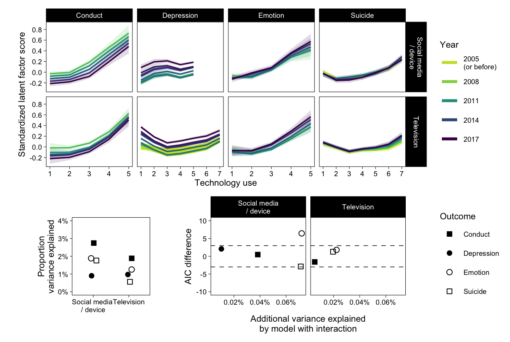

# GAM


## Data


```r
mtf <- read_rds("data/mtf.rds")
us <- read_rds("data/us.rds")
yrbs <- read_rds("data/yrbs.rds")

us <- mutate(us, across(sdqc:sdqv, ordered))
yrbs <- mutate(yrbs, across(sad_lonely:suicide_3, ordered))

# Drop rows where all outcome items are missing
# And remove mean outcome (will use latent factors)
mtf <- drop_na(mtf, Depression) %>% select(-Depression)
us <- drop_na(us, Emotion, Conduct) %>% select(-Emotion, -Conduct)
yrbs <- drop_na(yrbs, Suicide) %>% select(-Suicide)
```

## Models

Roadmap:

- For each outcome in each dataset, a multiple indicator latent variable is created with lavaan
- Those latent variables are extracted back to the main data frames
- Latent variables are treated as outcomes in GAMs
- GAMs treat predictors with smooths to allow wiggliness
- Two models are compared: one with smooth X and year, one with smooth X, year, and smooth X by year interaction
- Present all model comparisons and R squareds

## Create latent variables for outcomes


```r
fit_sem <- function(data, items, y, missing = "ml") {
  
  # Combine names of items to a string for lavaan model
  items_all <- paste0(items, collapse = " + ")
  
  # Model strings
  sem0 <- str_glue("{y} =~ {items_all}")
  
  ml0 <- sem(sem0, data = data, missing = missing)
  
  return(bind_cols(data, as.data.frame(predict(ml0))))
  
}
```


```r
mtf_mod <- '
  Depression =~ D_B_1 + D_B_2 + D_B_3 + D_B_4 + D_B_5 + D_B_6
'
out <- cfa(mtf_mod, data = mtf, missing = "ml", std.lv = TRUE)
mtf <- bind_cols(mtf, as.data.frame(predict(out)))
mtf$Depression <- as.numeric(scale(mtf$Depression))
```


```r
us_mod <- '
  Conduct =~ sdqe + sdqg + sdql + sdqr + sdqv
  Emotion =~ sdqc + sdqh + sdqm + sdqp + sdqx 
'
out <- cfa(us_mod, data = us, missing = "pairwise", std.lv = TRUE)
us <- bind_cols(us, as.data.frame(predict(out)))
us$Conduct <- as.numeric(scale(us$Conduct))
us$Emotion <- as.numeric(scale(us$Emotion))
```


```r
yrbs_mod <- '
  Suicide =~ sad_lonely + suicide_1 + suicide_2 + suicide_3
'
out <- cfa(yrbs_mod, data = yrbs, missing = "pairwise", std.lv = TRUE)
yrbs <- bind_cols(yrbs, as.data.frame(predict(out)))
yrbs$Suicide <- as.numeric(scale(yrbs$Suicide))
```

## Estimate GAMs


```r
fit <- function(data, x, y, name) {
  
  # Center year
  data <- mutate(data, Year = Year - 2017)

  # Drop rows with missing predictor
  data <- drop_na(data, all_of(x))
  
  # Ensure max knots
  k_x <- length(table(data[[x]]))
  k_yr <- length(table(data[["Year"]]))

  # Model strings
  model0 <- str_glue("{y} ~ ti(Year, k = {k_yr})")
  model1 <- str_glue("{y} ~ ti(Year, k = {k_yr}) + ti({x}, k = {k_x})")
  model2 <- str_glue(
    "{y} ~ ti(Year, k = {k_yr}) + ti({x}, k = {k_x}) + ti({x}, Year, k = c({k_x}, {k_yr}))"
  )
  
  fit0 <- gam(as.formula(model0), data = data, method = "REML")
  fit1 <- gam(as.formula(model1), data = data, method = "REML")
  fit2 <- gam(as.formula(model2), data = data, method = "REML")
  
  return(
    tibble(
      name, x, y, 
      fit0 = list(fit0), fit1 = list(fit1), fit2 = list(fit2)
    )
  )
}
```


```r
if (!file.exists("models/gams.rds")) {
  x1 <- fit(mtf, "SM", "Depression", "MTF")
  x2 <- fit(mtf, "TV", "Depression", "MTF")
  x3 <- fit(us, "SM", "Conduct", "US")
  x4 <- fit(us, "TV", "Conduct", "US")
  x5 <- fit(us, "SM", "Emotion", "US")
  x6 <- fit(us, "TV", "Emotion", "US")
  x7 <- fit(yrbs, "DV", "Suicide", "YRBS")
  x8 <- fit(yrbs, "TV", "Suicide", "YRBS")
  
  # Rename variables
  fits <- bind_rows(x1,x2,x3,x4,x5,x6,x7,x8)
  fits <- fits %>% 
    rename(Technology = x, Outcome = y, Study = name) %>% 
    mutate(
      Technology = ifelse(
        Technology %in% c("SM", "DV"), 
        "Social media / device", 
        "Television"
      )
    )
  saveRDS(fits, "models/gams.rds")
} else {fits <- readRDS("models/gams.rds")}
```


```r
out <- fits %>% 
  pivot_longer(fit0:fit2) %>% 
  mutate(
    rsq = map_dbl(value, ~summary(.)$r.sq),
    dev = map_dbl(value, ~summary(.)$dev.expl),
    aic = map_dbl(value, AIC)
  ) %>% 
  select(-value) %>% 
  pivot_wider(values_from = rsq:aic)
kable(out, digits = 2)
```


|Study |Technology            |Outcome    | rsq_fit0| rsq_fit1| rsq_fit2| dev_fit0| dev_fit1| dev_fit2|   aic_fit0|   aic_fit1|   aic_fit2|
|:-----|:---------------------|:----------|--------:|--------:|--------:|--------:|--------:|--------:|----------:|----------:|----------:|
|MTF   |Social media / device |Depression |     0.01|     0.01|     0.01|     0.01|     0.01|     0.01|  347916.95|  347694.60|  347692.53|
|MTF   |Television            |Depression |     0.00|     0.01|     0.01|     0.00|     0.01|     0.01| 1038065.36| 1035800.03| 1035710.03|
|US    |Social media / device |Conduct    |     0.00|     0.03|     0.03|     0.00|     0.03|     0.03|   53280.58|   52826.26|   52825.78|
|US    |Television            |Conduct    |     0.00|     0.02|     0.02|     0.00|     0.02|     0.02|   54062.73|   53781.76|   53783.35|
|US    |Social media / device |Emotion    |     0.00|     0.02|     0.02|     0.00|     0.02|     0.02|   53374.18|   53045.29|   53038.83|
|US    |Television            |Emotion    |     0.00|     0.01|     0.01|     0.00|     0.01|     0.01|   54123.54|   53912.85|   53911.05|
|YRBS  |Social media / device |Suicide    |     0.00|     0.02|     0.02|     0.00|     0.02|     0.02|   83550.64|   83051.90|   83054.78|
|YRBS  |Television            |Suicide    |     0.00|     0.01|     0.01|     0.00|     0.01|     0.01|   83510.82|   83369.27|   83367.99|

Figure of fitted X - Y lines per year


```r
fits
```

<div data-pagedtable="false">
  <script data-pagedtable-source type="application/json">
{"columns":[{"label":["Study"],"name":[1],"type":["chr"],"align":["left"]},{"label":["Technology"],"name":[2],"type":["chr"],"align":["left"]},{"label":["Outcome"],"name":[3],"type":["chr"],"align":["left"]},{"label":["fit0"],"name":[4],"type":["list"],"align":["right"]},{"label":["fit1"],"name":[5],"type":["list"],"align":["right"]},{"label":["fit2"],"name":[6],"type":["list"],"align":["right"]}],"data":[{"1":"MTF","2":"Social media / device","3":"Depression","4":"<S3: gam>","5":"<S3: gam>","6":"<S3: gam>"},{"1":"MTF","2":"Television","3":"Depression","4":"<S3: gam>","5":"<S3: gam>","6":"<S3: gam>"},{"1":"US","2":"Social media / device","3":"Conduct","4":"<S3: gam>","5":"<S3: gam>","6":"<S3: gam>"},{"1":"US","2":"Television","3":"Conduct","4":"<S3: gam>","5":"<S3: gam>","6":"<S3: gam>"},{"1":"US","2":"Social media / device","3":"Emotion","4":"<S3: gam>","5":"<S3: gam>","6":"<S3: gam>"},{"1":"US","2":"Television","3":"Emotion","4":"<S3: gam>","5":"<S3: gam>","6":"<S3: gam>"},{"1":"YRBS","2":"Social media / device","3":"Suicide","4":"<S3: gam>","5":"<S3: gam>","6":"<S3: gam>"},{"1":"YRBS","2":"Television","3":"Suicide","4":"<S3: gam>","5":"<S3: gam>","6":"<S3: gam>"}],"options":{"columns":{"min":{},"max":[10]},"rows":{"min":[10],"max":[10]},"pages":{}}}
  </script>
</div>

```r
foo <- function(row) {
  fit <- fits$fit2[[row]]
  newx <- distinct(fit[["model"]][,2:3])
  preds <- cbind(newx, predict(fit, newdata = newx, se.fit = TRUE)) %>% 
    as_tibble()
  names(preds)[2] <- "x"
  preds$Year <- preds$Year + 2017
  return(preds)
}
bar <- function(row) {
  fit <- fits$fit2[[row]]
  newx <- as_tibble(fit[["model"]])
  names(newx) <- c("y", "Year", "x")
  newx$Year <- newx$Year + 2017
  return(newx)
}

fits$outs <- map(1:8, foo)
fits$dats <- map(1:8, bar)
p01 <- fits %>% 
  select(-c(fit0:fit2, dats)) %>% 
  unnest(outs) %>% 
  # mutate(Year2 = Year, Year = factor(ifelse(Year < 2005, "< 2005", Year))) %>% 
  ggplot(aes(x, fit, col = Year, group = Year, fill = Year)) +
  scale_colour_viridis_c(
    aesthetics = c("color", "fill"), 
    direction = -1, end = .95, values = c(.6, 1), na.value = "#C9DF2F",
    guide = "legend", 
    breaks = c(2005, 2008, 2011, 2014, 2017), 
    labels = c("2005\n(or before)", 2008, 2011, 2014, 2017)
    ) +
  scale_y_continuous(breaks = pretty_breaks()) +
  scale_x_continuous(breaks = pretty_breaks()) +
  # Can add points but this renders trends invisibly small
  # geom_point(
  #   data = unnest(select(fits, -c(fit0:fit2, outs)), dats),
  #   aes(x=x, y=y), size = .1, alpha = .075,
  #   position = position_jitter(.25, 0, seed = 1)
  # ) +
  geom_ribbon(
    aes(ymin = fit-se.fit*2, ymax = fit+se.fit*2), 
    alpha = .15, col = NA, show.legend = FALSE
  ) +
  geom_line(size = .6) +
  guides(
    color = guide_legend(
      override.aes = list(size = 1.25)
    )
  ) + 
  labs(x = "Technology use", y = "Standardized latent factor score") +
  facet_grid(
    Technology~Outcome, scales = "free_x", labeller = label_wrap_gen(13)
  )
p01
```


```r
p1 <- out %>% 
  ggplot(aes(Technology, dev_fit1, shape = Outcome)) +
  scale_y_continuous(
    "Proportion\nvariance explained",
    limits = c(0, .04), 
    labels = function(x) percent(x, 1)
  ) +
  scale_x_discrete(labels = function(x) str_replace(x, "/", "\n/")) +
  geom_point(position = position_jitter(.1, seed = 1), size = 2) +
  scale_shape_manual(values = c(15, 16, 21, 22)) +
  theme(
    legend.position = "none", 
    aspect.ratio = 1, 
    axis.title.x = element_blank()
  )
p2 <- out %>%   
  ggplot(aes(dev_fit2-dev_fit1, aic_fit1-aic_fit2, shape = Outcome)) +
  geom_hline(yintercept = c(-3, 3), lty = 2, size = .25) +
  scale_shape_manual(values = c(15, 16, 21, 22)) +
  geom_point(size = 2) +
  labs(y = "AIC difference") +
  coord_cartesian(ylim = c(-10, 10)) +
  scale_x_continuous(
    "Additional variance explained\nby model with interaction",
    labels = function(x) percent(x, .01)
  ) +
  facet_wrap("Technology", labeller = label_wrap_gen(13)) +
  theme()
p01 / ((p1 | p2) + plot_layout(widths = c(4, 6))) + plot_layout(heights = c(65, 35))
```



```r
ggsave("Figure3.png", width = 7, height = 5)
filter(out, Study=="MTF") %>% 
  mutate(delta_aic = aic_fit1-aic_fit2, delta_dev = percent(dev_fit2-dev_fit1)) %>% 
  select(Study:Outcome, starts_with("delta")) 
```

<div data-pagedtable="false">
  <script data-pagedtable-source type="application/json">
{"columns":[{"label":["Study"],"name":[1],"type":["chr"],"align":["left"]},{"label":["Technology"],"name":[2],"type":["chr"],"align":["left"]},{"label":["Outcome"],"name":[3],"type":["chr"],"align":["left"]},{"label":["delta_aic"],"name":[4],"type":["dbl"],"align":["right"]},{"label":["delta_dev"],"name":[5],"type":["chr"],"align":["left"]}],"data":[{"1":"MTF","2":"Social media / device","3":"Depression","4":"2.07363","5":"0.010%"},{"1":"MTF","2":"Television","3":"Depression","4":"90.00266","5":"0.032%"}],"options":{"columns":{"min":{},"max":[10]},"rows":{"min":[10],"max":[10]},"pages":{}}}
  </script>
</div>

## Session information


```r
options(width = 120)
library(sessioninfo)
session_info()
```

```
## ─ Session info ───────────────────────────────────────────────────────────────────────────────────────────────────────
##  setting  value                       
##  version  R version 4.0.3 (2020-10-10)
##  os       Ubuntu 20.04.1 LTS          
##  system   x86_64, linux-gnu           
##  ui       X11                         
##  language (EN)                        
##  collate  C.UTF-8                     
##  ctype    C.UTF-8                     
##  tz       Europe/London               
##  date     2020-12-18                  
## 
## ─ Packages ───────────────────────────────────────────────────────────────────────────────────────────────────────────
##  package        * version  date       lib source                            
##  abind            1.4-5    2016-07-21 [1] CRAN (R 4.0.2)                    
##  assertthat       0.2.1    2019-03-21 [1] CRAN (R 4.0.2)                    
##  backports        1.2.1    2020-12-09 [1] CRAN (R 4.0.3)                    
##  base64enc        0.1-3    2015-07-28 [1] CRAN (R 4.0.2)                    
##  bayesplot        1.7.2    2020-05-28 [1] CRAN (R 4.0.2)                    
##  bookdown         0.21.6   2020-12-16 [1] Github (rstudio/bookdown@92c59d3) 
##  boot             1.3-25   2020-04-26 [4] CRAN (R 4.0.0)                    
##  bridgesampling   1.0-0    2020-02-26 [1] CRAN (R 4.0.2)                    
##  brms           * 2.14.4   2020-11-03 [1] CRAN (R 4.0.3)                    
##  Brobdingnag      1.2-6    2018-08-13 [1] CRAN (R 4.0.2)                    
##  broom            0.7.2    2020-10-20 [1] CRAN (R 4.0.3)                    
##  callr            3.5.1    2020-10-13 [1] CRAN (R 4.0.2)                    
##  cellranger       1.1.0    2016-07-27 [1] CRAN (R 4.0.2)                    
##  cli              2.2.0    2020-11-20 [1] CRAN (R 4.0.3)                    
##  coda             0.19-4   2020-09-30 [1] CRAN (R 4.0.2)                    
##  codetools        0.2-18   2020-11-04 [4] CRAN (R 4.0.3)                    
##  colorspace       2.0-0    2020-11-11 [1] CRAN (R 4.0.3)                    
##  colourpicker     1.1.0    2020-09-14 [1] CRAN (R 4.0.2)                    
##  crayon           1.3.4    2017-09-16 [1] CRAN (R 4.0.2)                    
##  crosstalk        1.1.0.1  2020-03-13 [1] CRAN (R 4.0.2)                    
##  curl             4.3      2019-12-02 [1] CRAN (R 4.0.2)                    
##  DBI              1.1.0    2019-12-15 [1] CRAN (R 4.0.2)                    
##  dbplyr           2.0.0    2020-11-03 [1] CRAN (R 4.0.3)                    
##  digest           0.6.27   2020-10-24 [1] CRAN (R 4.0.3)                    
##  dplyr          * 1.0.2    2020-08-18 [1] CRAN (R 4.0.2)                    
##  DT               0.16     2020-10-13 [1] CRAN (R 4.0.2)                    
##  dygraphs         1.1.1.6  2018-07-11 [1] CRAN (R 4.0.2)                    
##  ellipsis         0.3.1    2020-05-15 [1] CRAN (R 4.0.2)                    
##  emmeans          1.5.3    2020-12-09 [1] CRAN (R 4.0.3)                    
##  estimability     1.3      2018-02-11 [1] CRAN (R 4.0.2)                    
##  evaluate         0.14     2019-05-28 [1] CRAN (R 4.0.2)                    
##  fansi            0.4.1    2020-01-08 [1] CRAN (R 4.0.2)                    
##  farver           2.0.3    2020-01-16 [1] CRAN (R 4.0.2)                    
##  fastmap          1.0.1    2019-10-08 [1] CRAN (R 4.0.2)                    
##  forcats        * 0.5.0    2020-03-01 [1] CRAN (R 4.0.2)                    
##  fs               1.5.0    2020-07-31 [1] CRAN (R 4.0.2)                    
##  future         * 1.21.0   2020-12-10 [1] CRAN (R 4.0.3)                    
##  gamm4            0.2-6    2020-04-03 [1] CRAN (R 4.0.3)                    
##  generics         0.1.0    2020-10-31 [1] CRAN (R 4.0.3)                    
##  ggplot2        * 3.3.2    2020-06-19 [1] CRAN (R 4.0.2)                    
##  ggridges         0.5.2    2020-01-12 [1] CRAN (R 4.0.2)                    
##  ggstance       * 0.3.4    2020-04-02 [1] CRAN (R 4.0.2)                    
##  globals          0.14.0   2020-11-22 [1] CRAN (R 4.0.3)                    
##  glue             1.4.2    2020-08-27 [1] CRAN (R 4.0.2)                    
##  gridExtra        2.3      2017-09-09 [1] CRAN (R 4.0.2)                    
##  gtable           0.3.0    2019-03-25 [1] CRAN (R 4.0.2)                    
##  gtools           3.8.2    2020-03-31 [1] CRAN (R 4.0.2)                    
##  haven            2.3.1    2020-06-01 [1] CRAN (R 4.0.2)                    
##  highr            0.8      2019-03-20 [1] CRAN (R 4.0.2)                    
##  hms              0.5.3    2020-01-08 [1] CRAN (R 4.0.2)                    
##  htmltools        0.5.0    2020-06-16 [1] CRAN (R 4.0.2)                    
##  htmlwidgets      1.5.3    2020-12-10 [1] CRAN (R 4.0.3)                    
##  httpuv           1.5.4    2020-06-06 [1] CRAN (R 4.0.2)                    
##  httr             1.4.2    2020-07-20 [1] CRAN (R 4.0.2)                    
##  igraph           1.2.6    2020-10-06 [1] CRAN (R 4.0.2)                    
##  inline           0.3.17   2020-12-01 [1] CRAN (R 4.0.3)                    
##  jsonlite         1.7.2    2020-12-09 [1] CRAN (R 4.0.3)                    
##  knitr          * 1.30     2020-09-22 [1] CRAN (R 4.0.2)                    
##  labeling         0.4.2    2020-10-20 [1] CRAN (R 4.0.3)                    
##  later            1.1.0.1  2020-06-05 [1] CRAN (R 4.0.2)                    
##  lattice          0.20-41  2020-04-02 [4] CRAN (R 4.0.0)                    
##  lavaan         * 0.6-7    2020-07-31 [1] CRAN (R 4.0.2)                    
##  lifecycle        0.2.0    2020-03-06 [1] CRAN (R 4.0.2)                    
##  listenv          0.8.0    2019-12-05 [1] CRAN (R 4.0.2)                    
##  lme4             1.1-26   2020-12-01 [1] CRAN (R 4.0.3)                    
##  loo              2.4.1    2020-12-09 [1] CRAN (R 4.0.3)                    
##  lubridate        1.7.9.2  2020-11-13 [1] CRAN (R 4.0.3)                    
##  magrittr         2.0.1    2020-11-17 [1] CRAN (R 4.0.3)                    
##  markdown         1.1      2019-08-07 [1] CRAN (R 4.0.2)                    
##  MASS             7.3-53   2020-09-09 [4] CRAN (R 4.0.2)                    
##  Matrix           1.2-18   2019-11-27 [4] CRAN (R 4.0.0)                    
##  matrixStats      0.57.0   2020-09-25 [1] CRAN (R 4.0.2)                    
##  mgcv           * 1.8-33   2020-08-27 [1] CRAN (R 4.0.2)                    
##  mime             0.9      2020-02-04 [1] CRAN (R 4.0.2)                    
##  miniUI           0.1.1.1  2018-05-18 [1] CRAN (R 4.0.2)                    
##  minqa            1.2.4    2014-10-09 [1] CRAN (R 4.0.2)                    
##  mnormt           2.0.2    2020-09-01 [1] CRAN (R 4.0.2)                    
##  modelr           0.1.8    2020-05-19 [1] CRAN (R 4.0.2)                    
##  multcomp         1.4-15   2020-11-14 [1] CRAN (R 4.0.3)                    
##  munsell          0.5.0    2018-06-12 [1] CRAN (R 4.0.2)                    
##  mvtnorm          1.1-1    2020-06-09 [1] CRAN (R 4.0.2)                    
##  nlme           * 3.1-150  2020-10-24 [4] CRAN (R 4.0.3)                    
##  nloptr           1.2.2.2  2020-07-02 [1] CRAN (R 4.0.2)                    
##  pacman           0.5.1    2019-03-11 [1] CRAN (R 4.0.2)                    
##  parallelly       1.22.0   2020-12-13 [1] CRAN (R 4.0.3)                    
##  patchwork      * 1.1.0    2020-11-09 [1] CRAN (R 4.0.3)                    
##  pbivnorm         0.6.0    2015-01-23 [1] CRAN (R 4.0.2)                    
##  pillar           1.4.7    2020-11-20 [1] CRAN (R 4.0.3)                    
##  pkgbuild         1.2.0    2020-12-15 [1] CRAN (R 4.0.3)                    
##  pkgconfig        2.0.3    2019-09-22 [1] CRAN (R 4.0.2)                    
##  plyr             1.8.6    2020-03-03 [1] CRAN (R 4.0.2)                    
##  prettyunits      1.1.1    2020-01-24 [1] CRAN (R 4.0.2)                    
##  processx         3.4.5    2020-11-30 [1] CRAN (R 4.0.3)                    
##  projpred         2.0.2    2020-10-28 [1] CRAN (R 4.0.3)                    
##  promises         1.1.1    2020-06-09 [1] CRAN (R 4.0.2)                    
##  ps               1.5.0    2020-12-05 [1] CRAN (R 4.0.3)                    
##  purrr          * 0.3.4    2020-04-17 [1] CRAN (R 4.0.2)                    
##  R6               2.5.0    2020-10-28 [1] CRAN (R 4.0.3)                    
##  Rcpp           * 1.0.5    2020-07-06 [1] CRAN (R 4.0.2)                    
##  RcppParallel     5.0.2    2020-06-24 [1] CRAN (R 4.0.2)                    
##  readr          * 1.4.0    2020-10-05 [1] CRAN (R 4.0.2)                    
##  readxl           1.3.1    2019-03-13 [1] CRAN (R 4.0.2)                    
##  reprex           0.3.0    2019-05-16 [1] CRAN (R 4.0.2)                    
##  reshape2         1.4.4    2020-04-09 [1] CRAN (R 4.0.2)                    
##  rlang            0.4.9    2020-11-26 [1] CRAN (R 4.0.3)                    
##  rmarkdown        2.6.0001 2020-12-16 [1] Github (rstudio/rmarkdown@80f14b2)
##  rsconnect        0.8.16   2019-12-13 [1] CRAN (R 4.0.2)                    
##  rstan            2.21.3   2020-09-23 [1] Github (stan-dev/rstan@fd079b6)   
##  rstantools       2.1.1    2020-07-06 [1] CRAN (R 4.0.2)                    
##  rstudioapi       0.13     2020-11-12 [1] CRAN (R 4.0.3)                    
##  rvest            0.3.6    2020-07-25 [1] CRAN (R 4.0.2)                    
##  sandwich         3.0-0    2020-10-02 [1] CRAN (R 4.0.3)                    
##  scales         * 1.1.1    2020-05-11 [1] CRAN (R 4.0.2)                    
##  sessioninfo    * 1.1.1    2018-11-05 [1] CRAN (R 4.0.2)                    
##  shiny            1.5.0    2020-06-23 [1] CRAN (R 4.0.2)                    
##  shinyjs          2.0.0    2020-09-09 [1] CRAN (R 4.0.2)                    
##  shinystan        2.5.0    2018-05-01 [1] CRAN (R 4.0.2)                    
##  shinythemes      1.1.2    2018-11-06 [1] CRAN (R 4.0.2)                    
##  StanHeaders      2.21.0-6 2020-08-16 [1] CRAN (R 4.0.2)                    
##  statmod          1.4.35   2020-10-19 [1] CRAN (R 4.0.3)                    
##  stringi          1.5.3    2020-09-09 [1] CRAN (R 4.0.2)                    
##  stringr        * 1.4.0    2019-02-10 [1] CRAN (R 4.0.2)                    
##  survival         3.2-7    2020-09-28 [4] CRAN (R 4.0.2)                    
##  TH.data          1.0-10   2019-01-21 [1] CRAN (R 4.0.3)                    
##  threejs          0.3.3    2020-01-21 [1] CRAN (R 4.0.2)                    
##  tibble         * 3.0.4    2020-10-12 [1] CRAN (R 4.0.2)                    
##  tidyr          * 1.1.2    2020-08-27 [1] CRAN (R 4.0.2)                    
##  tidyselect       1.1.0    2020-05-11 [1] CRAN (R 4.0.2)                    
##  tidyverse      * 1.3.0    2019-11-21 [1] CRAN (R 4.0.2)                    
##  tmvnsim          1.0-2    2016-12-15 [1] CRAN (R 4.0.2)                    
##  V8               3.4.0    2020-11-04 [1] CRAN (R 4.0.3)                    
##  vctrs            0.3.5    2020-11-17 [1] CRAN (R 4.0.3)                    
##  viridisLite      0.3.0    2018-02-01 [1] CRAN (R 4.0.2)                    
##  withr            2.3.0    2020-09-22 [1] CRAN (R 4.0.2)                    
##  xfun             0.19     2020-10-30 [1] CRAN (R 4.0.3)                    
##  xml2             1.3.2    2020-04-23 [1] CRAN (R 4.0.2)                    
##  xtable           1.8-4    2019-04-21 [1] CRAN (R 4.0.2)                    
##  xts              0.12.1   2020-09-09 [1] CRAN (R 4.0.2)                    
##  yaml             2.2.1    2020-02-01 [1] CRAN (R 4.0.2)                    
##  zoo              1.8-8    2020-05-02 [1] CRAN (R 4.0.2)                    
## 
## [1] /home/matti/R/x86_64-pc-linux-gnu-library/4.0
## [2] /usr/local/lib/R/site-library
## [3] /usr/lib/R/site-library
## [4] /usr/lib/R/library
```
